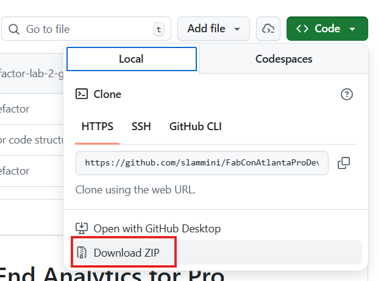

# Power BI Meets Agentic AI: A Hands-On Workshop from Setup to Impact

AI-powered agents are reshaping how we build Power BI solutions – and this workshop puts you in the driver’s seat. Whether you’re curious about agentic development or ready to integrate it into your workflow, this full-day, hands-on workshop will take you from foundational concepts to building semantic models and reports with GitHub Copilot and MCP servers in Microsoft Fabric.

You’ll start by understanding what agentic development really is: how it works and where it delivers real value through practical, real-world use cases. From there, you’ll set up your own environment and progressively work through guided exercises that cover the full Power BI development lifecycle – from semantic model design to report creation – while also learning where these approaches shine and where traditional methods still matter.

Walk away ready to apply agentic development to your Power BI projects with confidence – knowing both its strengths and its boundaries.

## 🏁 Get started

- Ensure you met all the [Requirements](#-requirements) before starting the labs.
- Download this repository to your machine.
  
  
  
  Unzip the folder to a location of your choice. You will use the resource files in this folder throughout the labs.

- Open the [lab documents](#-labs) in your browser for a better reading experience.

## 🧪 Labs

### [Lab 1 — Agentic Power BI on the Web](lab1/lab.md)

This lab introduces Power BI's built-in agentic authoring experiences. Using **Web Modeling Copilot** and the **Modeling Agent**, you will update semantic models, create measures, generate descriptions, batch-edit metadata, and prepare models for AI — all directly in the browser with no installation required.

### [Lab 2 — Personalized Power BI Agents](lab2/lab.md)

This lab shows how to extend and personalize agentic Power BI development. You will use skills, MCP capabilities, PBIP, and code-first tooling to customize agent behavior, encode team standards, and apply your own modeling best practices across semantic models and reports.

### [Lab 3 — Build Data Apps with Fabric](lab3/lab.md)

This lab takes agentic development beyond model authoring and into application creation. Starting from an existing semantic model, you will use **Fabric Data Apps** and natural-language prompts to generate, customize, and refine highly personalized analytical applications—including experiences inspired by screenshots and design concepts.

## ✅ Requirements

### Technical Knowledge

Participants should have practical Power BI experience. No prior knowledge of agentic development, GitHub Copilot, or MCP servers is required.
Participants should be able to:
-	Use Power BI Desktop to connect to data and build a report
-	Understand core Power BI semantic model concepts such as tables, relationships, measures, and DAX
-	Navigate the Power BI interface and common authoring workflows

### Tools & Access

-	Windows Laptop with administrator permissions
-	Modern web browser such as Microsoft Edge or Google Chrome
-	Access to a Fabric-enabled tenant (Microsoft workshop provided)
  - [XMLA Endpoint](https://learn.microsoft.com/en-us/fabric/enterprise/powerbi/service-premium-connect-tools#security) must be enabled in tenant and capacity
  - [Fabric Apps](https://learn.microsoft.com/en-us/fabric/apps/create-app#enable-fabric-app-in-tenant-admin-settings) must be enabled in tenant
  - Admin permission to a Fabric workspace in this tenant
-	[GitHub personal account](https://github.com/signup) (GitHub enterprise account wont work)
-	[GitHub Copilot license](https://github.com/features/copilot/plans) (Microsoft workshop-provided your personal GitHub account)
  - See [sign-up-copilot-license](sign-up-copilot-license.md) for instructions on how to sign-up for a GitHub Copilot license for this workshop.
-	[Power BI Desktop](https://pbi.onl/download) (latest release)
-	[Visual Studio Code](https://code.visualstudio.com/download) (latest release)
-	[Git for Windows](https://gitforwindows.org/)
-	[Node.js and npm](https://nodejs.org/en/download/)
