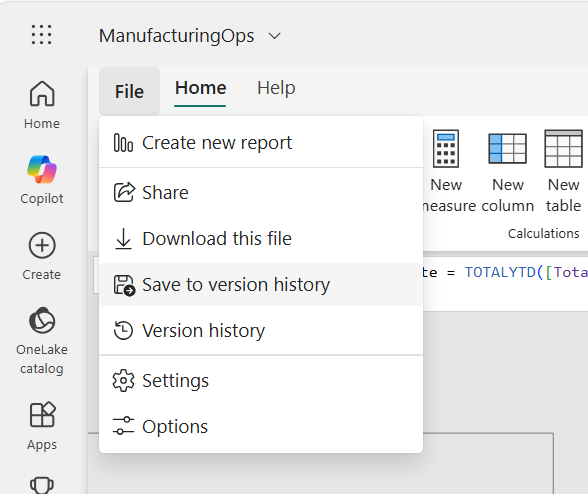
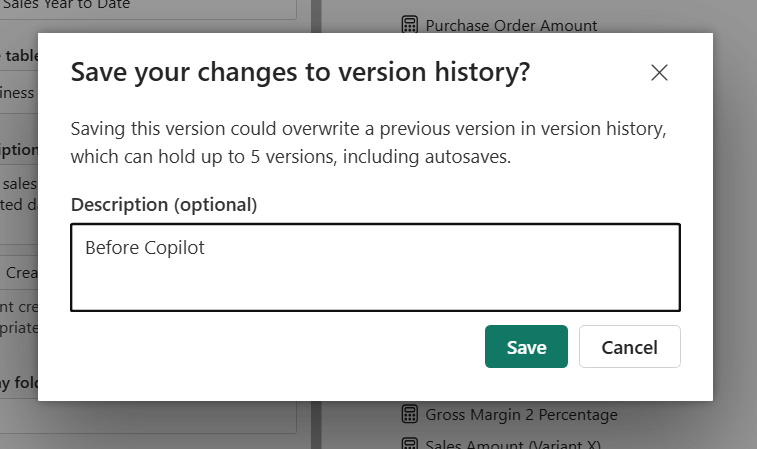
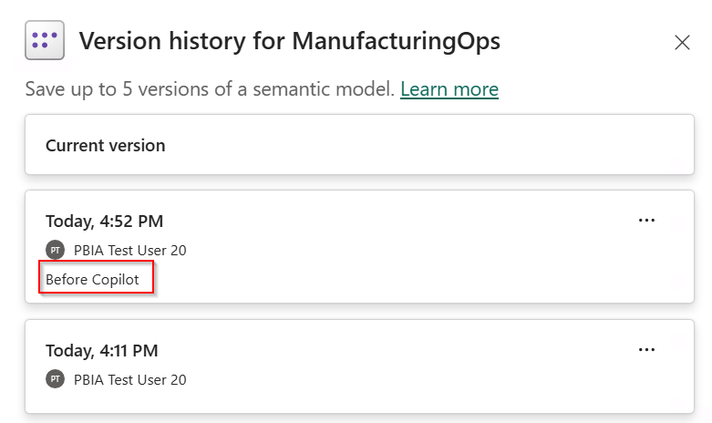
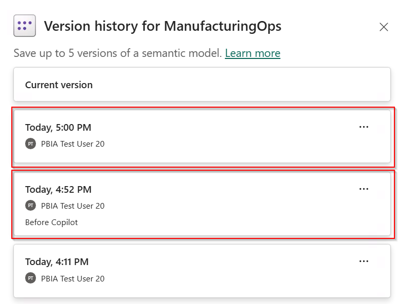
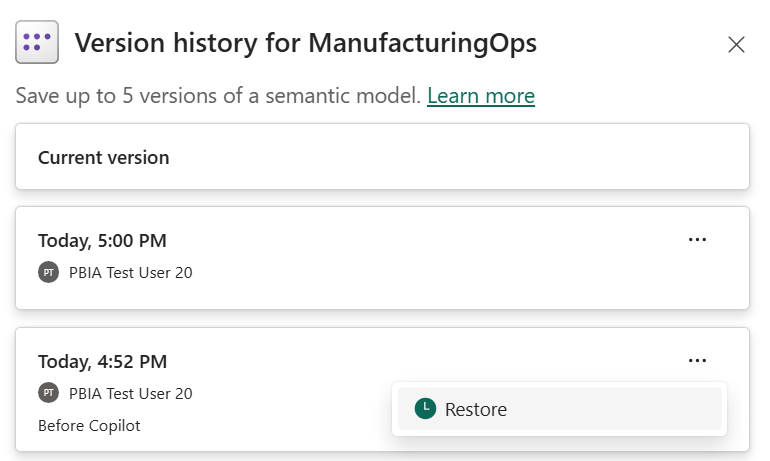

# Lab - Agentic Web Modeling with Copilot

⏱️ **Total duration:** 75 minutes

## Overview

In this lab, you inherit the **ManufacturingOps** semantic model from another analyst. You are not familiar with the model, its structure, or the business logic behind it. Before making any changes, you will use [**Copilot in Power BI web modeling**](https://learn.microsoft.com/power-bi/transform-model/copilot-web-modeling) to explore the model and understand how its tables, relationships, and measures support the Sales, Inventory, Procurement, and Production business domains.

Once you are familiar with the model, Copilot will help you identify and make targeted improvements. You will complete the entire lab in the browser, with no local installation required or extra licensing other than Fabric/Premium capacity.

## What you will learn

- How to explore and understand a semantic model using Copilot.
- How to analyze model structure, naming, and metadata
- How to apply modeling changes using Copilot.
- How to review and validate AI-assisted model changes
- How to save a clean version and recover from an unwanted change using version history

## Lab structure

| Section | Learning goal |
| ------- | ------------- |
| [Prerequisites](#prerequisites) | Confirm access and understand workspace isolation |
| [0. Prepare the environment](#0-prepare-the-environment) | Create your workspace and upload the workshop model |
| [1. Explore the model](#1-explore-the-model) | Understand the inherited model |
| [2. Improve the semantic model names](#2-improve-the-semantic-model-names) | Improve measure names, descriptions, formatting, and organization |
| [3. Create time intelligence measures](#3-create-time-intelligence-measures) | Create new measures that follow the model's development style |
| [4. Revert unwanted changes with version history](#4-revert-unwanted-changes-with-version-history) | Restore the model after an unwanted Copilot change |

## Prerequisites

Before beginning the lab, confirm that you have:

* Access to the workshop's Fabric tenant with permission to create a workspace
* Access to a Copilot-supported Fabric capacity
* A Power BI Pro license
* Access to Copilot in Power BI web modeling
* A modern web browser such as Microsoft Edge, Google Chrome, or Mozilla Firefox
* The workshop PBIX file containing the **ManufacturingOps** semantic model downloaded to your computer

All participants should use the workshop-provided model rather than selecting their own model. This ensures that the prompts, expected results, and validation steps remain consistent across the workshop.

## 0. Prepare the environment

✅ **Goal**: Create an isolated Fabric workspace and upload the workshop model

### Create a workspace

1. Go to [Power BI](https://app.powerbi.com) and sign in with the workshop account.
2. Select **Workspaces** > **New workspace**.
3. Name the workspace using this convention:

	```text
	FabCon-Agentic-Lab1-[YourInitials]
	```

4. Assign the workspace to the avaiable Fabric/Premium capacity and select **Apply**.
5. Select **Apply** and wait for the workspace to be created.

### Upload the workshop model

1. In your new workspace, select **Import** > **Report, Paginated Report, or Workbook** > **From this Computer**
2. Select the [resources/ManufacturingOps.pbix](resources/ManufacturingOps.pbix) file from this lab resources.
3. Select **Open** and wait for the semantic model and associated report to appear.

### Verify the model

1. Open the semantic model, not the report.
2. Confirm that the model opens without errors and displays its tables, columns, measures, and relationships.

## 1. Explore the model

✅ **Goal**: Understand the purpose and structure of the inherited semantic model before making changes.

### Steps

1. Open **ManufacturingOps** semantic model (not the report) from the workspace.
2. Switch to **Editing** mode.
	
	

3. Select **Copilot** from the ribbon.

	
      	
4. Enter the following prompt:

	```text
	Analyze this semantic model and help me understand its current structure.

	1. List the key tables in the model and categorize them as fact, dimension, utility.
	2. Summarize the business purpose of the model.
	3. Summarize the measures in the Business Measures table and the business questions they answer.
	4. Explain how the Sales, Inventory, Procurement, and Production domains are represented.
	5. Call out any parts of the model that may be difficult for a new report author to understand.	
	```
5. Select **Allow** to allow copilot to make changes to the semantic model.

	

> [!IMPORTANT]
> Selecting **Allow** gives Copilot permission to change the open semantic model for the entire chat session. Power BI creates a restore checkpoint when you grant permission, which you can use to return the model to its state at the start of the session. For more details, see [Controlled model updates](https://learn.microsoft.com/power-bi/transform-model/copilot-web-modeling#controlled-model-updates).

8. Review Copilot's response and compare it with the tables, relationships, columns, and measures shown in the model.
9. Ask a question about a specific model object to learn more about its value in the model. For example:

	```text
	Explain the business purpose of `Business Measures` and how it relates to the other
	objects in this model.	
	```

	Replace `Business Measures` with the name of the object you selected.

### Reflection

* How did Copilot help you become familiar with a semantic model you had not seen before?
* Which parts of Copilot's summary were most useful, and which parts did you need to verify against the model?
* How could access to Copilot from the browser help you explore other semantic models available through Power BI web modeling?

## 2. Improve the semantic model names

✅ **Goal**: Use Copilot to identify and fix inconsistent measure names, descriptions, formatting, and organization.

As you explore the inherited model, you notice that its measures do not follow a consistent naming pattern and are not organized clearly. Some descriptions are also missing or difficult to understand. These issues make ad hoc exploration harder for report authors and make it more difficult for AI consumption experiences like [Fabric IQ](https://learn.microsoft.com/en-us/fabric/iq/overview) to interpret the model correctly.


In this exercise, you will ask Copilot to review the measures and recommend improvements. You will review its recommendations before allowing it to update the model.

### Steps

1. Open a new Copilot session either by toggling the Copilot button or clicking on the **Erase Broom icon**. 

	

	> [!TIP]
	> Start a new Copilot session when you no longer need the previous conversation. Removing irrelevant context reduces token usage and helps Copilot focus on the current task, which can produce more relevant responses.

2. Enter the following prompt:

	```text
	Review all measures in this semantic model for inconsistencies in their names,
	descriptions, format strings, and display folders.

	Propose a consistent naming and organization pattern that makes the measures
	easier for report authors and AI experiences to understand. Follow these rules:

	- Use clear English names.
	- Use spaces instead of underscores.
	- Use business-friendly wording instead of technical abbreviations.
	- Use consistent capitalization and formatting.
	- Organize related measures into clear display folders.
	- Preserve the business meaning and DAX expression of every measure.

	For missing or unclear descriptions, propose a user-friendly description that
	explains the calculation in business terms. Keep each description under 200
	characters.

	Group the recommendations by business domain. For each recommendation, show the
	current value, proposed value, and reason for the change.

	Do not apply any changes.
	```

	**Expected outcome**

	- Copilot identifies inconsistent measure names, descriptions, format strings, and display folders.
	- The response proposes a consistent naming and organization pattern based on the rules in the prompt.
	- Recommendations are grouped by business domain and show the current value, proposed value, and reason for each change.	
	- Copilot does not apply any changes to the semantic model.

3. Review Copilot's recommendations before making any changes. 
4. When you are satisfied with the recommendations, enter the following prompt:

	```text
	Apply all recommendations
	```
	**Expected outcome**

	- Copilot applies all approved recommendations, resulting in consistent, business-friendly measure names.
	- Measures are organized into display folders by business domain.
	- Measures have concise descriptions that support user exploration and help AI experiences interpret the model.
	- Existing DAX expressions remain unchanged.
  
	

5. Review the changes made by Copilot. Measure names should be consistent, business friendly with business domain display folders.

### Reflection

* How valuable was Copilot for detecting patterns and inconsistencies across the measures and suggesting improvements?
* How much time would you need to complete the same review and update the model yourself?
* Power BI web modeling changes the semantic model directly in the workspace. What safeguards would you use to avoid making these changes in production? Consider working in a development workspace and tracking changes with Fabric Git integration.

## 3. Create time intelligence measures

✅ **Goal**: Use Copilot to create new time intelligence measures that follow the model's existing development style.

Copilot can inspect the semantic model and apply its existing patterns when it creates new objects. 

### Steps

1. Open a new Copilot session either by toggling the Copilot button or clicking on the **Erase Broom icon**. 
2. Enter the following prompt:

	```text
	Create time intelligence measures based on [Total Sales]: sales for the
	previous year, a 12-month moving average, and year-to-date sales.

	Follow the existing model measure development style. Use the model existing
	date table.
	```

	**Expected outcome**

	- Copilot reviews the model's existing measure development style, including its naming, formatting, descriptions, and organization.
	- Copilot creates the new previous-year, 12-month moving average, and year-to-date measures based on **[Total Sales]**.

3. Locate the three new measures in the model and confirm that they follow the naming, formatting, description, and display-folder patterns used by the existing measures.
4. Review the DAX for each measure. Confirm that it references **[Total Sales]**, uses the correct date column, and implements the intended time calculation.

### Reflection

* How well did Copilot understand and follow the model existing development patterns when creating new objects?
* What did you check in the generated DAX before accepting the measures as correct?

## 4. Revert unwanted changes with version history

✅ **Goal**: Use semantic model version history to restore the model after an unwanted Copilot change.

Copilot can make changes directly to the semantic model in the workspace. Version history provides a recovery point when an AI-assisted change produces an unwanted result. In this exercise, you will save a clean checkpoint, ask Copilot to make an intentionally bad change, and then restore the model.

### Steps

1. Open **File** and select **Save to version history**.
   
   

2. Add the following description, then select **Save**.

	```text
	Before Copilot
	```

	

3. Open **File** > **Version history** and confirm that the checkpoint appears with the expected description and timestamp.
   
   

4. Open a new Copilot session by toggling the **Copilot** button or selecting the **Erase Broom** icon.
5. Enter the following prompt to make an intentionally unwanted change:
   
	```text
	Rename table 'Business Measures' to '_Measures'
	```

6. Confirm that the `Business Measures` table was renamed to `_Measures`.
7. Open **File** > **View version history**.
8. Confirm that a new version appears after the version labeled `Before Copilot`.
   
	

9. Select the version labeled `Before Copilot`, choose **Restore**, and confirm the operation.
    
	

10. Confirm that the semantic model has been restored to its state before the intentional rename. You might need to refresh the browser.

### Reflection

* Version history makes it easy to revert an unwanted change, but restoring a complete model version might not provide enough granularity for every development workflow. You should consider other solutions for a more effective version control such as [Fabric Git integration](https://learn.microsoft.com/en-us/fabric/cicd/git-integration/git-get-started).

## ✅ Wrap-up

You've now learned how to:

* Use Copilot in Power BI web modeling to explore and understand an unfamiliar semantic model
* Review AI recommendations before applying changes directly to a semantic model
* Ask Copilot to change your semantic model for refactoring and new developments
* Use separate Copilot sessions to keep unrelated tasks from influencing each other
* Restore a semantic model after an unwanted Copilot change by using version history

## Useful links

* [Copilot in Power BI web modeling](https://learn.microsoft.com/power-bi/transform-model/copilot-web-modeling)
* [Edit data models in the Power BI service](https://learn.microsoft.com/power-bi/transform-model/service-edit-data-models)
* [Use Copilot with Power BI](https://learn.microsoft.com/power-bi/create-reports/copilot-introduction)
* [Semantic model version history](https://learn.microsoft.com/power-bi/transform-model/service-semantic-model-version-history)
* [Power BI naming conventions and best practices](https://learn.microsoft.com/power-bi/guidance/powerbi-implementation-planning-structure-tier-naming-conventions)