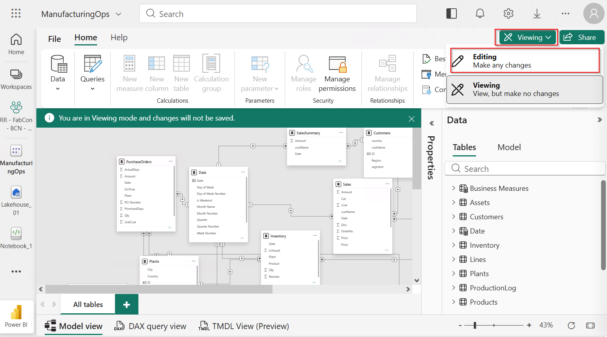
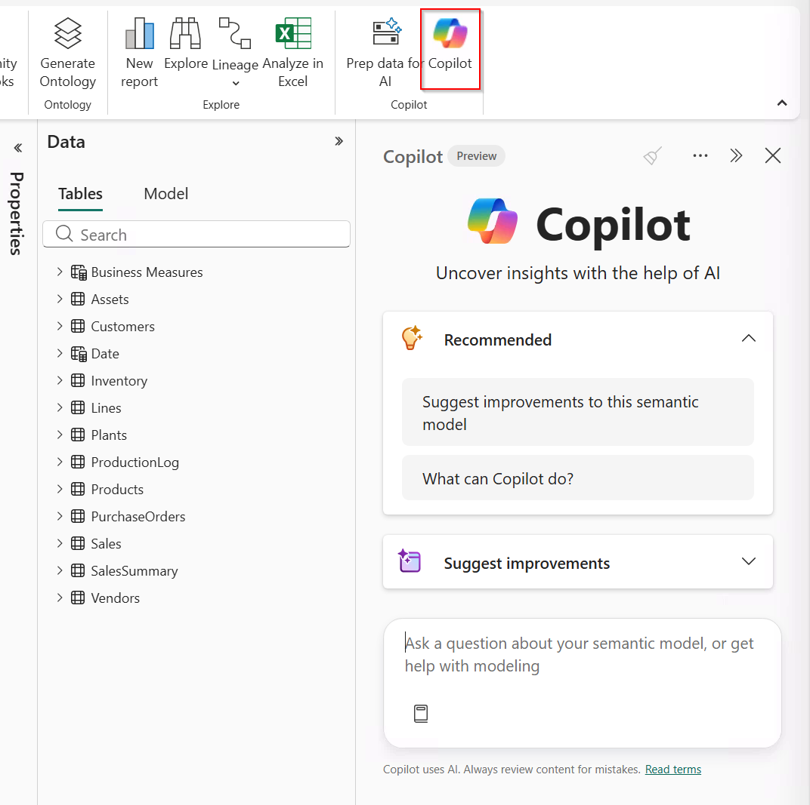
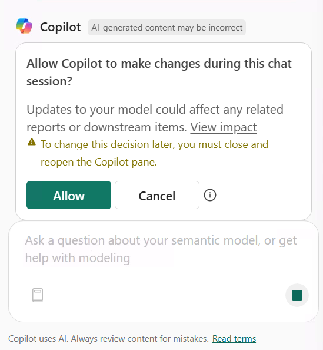
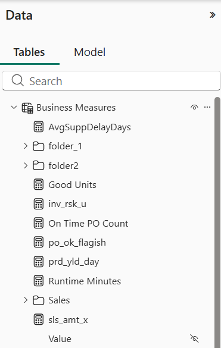
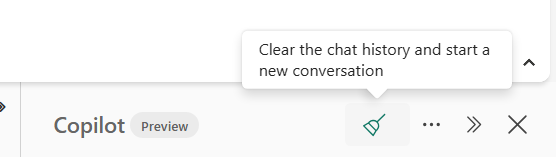
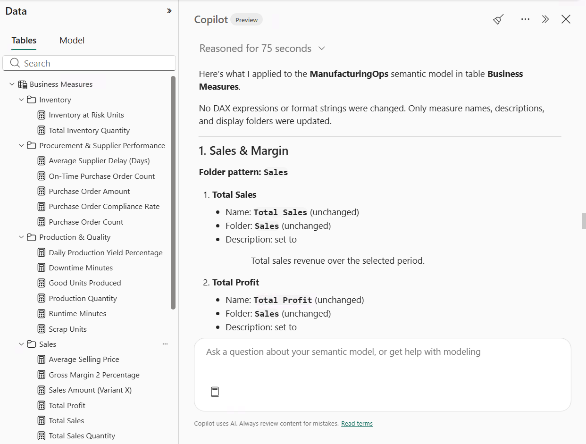

# Lab - Agentic Web Modeling with Copilot

⏱️ **Total duration:** 75 minutes

## Overview

In this lab, you inherit the **ManufacturingOps** semantic model from another analyst. You are not familiar with the model, its structure, or the business logic behind it. Before making any changes, you will use [**Copilot in Power BI web modeling**](https://learn.microsoft.com/power-bi/transform-model/copilot-web-modeling) to explore the model and understand how its tables, relationships, and measures support the Sales, Inventory, Procurement, and Production business domains.

Once you are familiar with the model, Copilot will help you identify and make targeted improvements. You will complete the entire lab in the browser, with no local installation required or extra licensing other than Fabric/Premium capacity.

## What you will learn

- How to explore and understand a semantic model using Copilot.
- How to analyze model structure, naming, and metadata
- How to apply modeling changes using Copilot.
- How to review and validate AI-assisted model changes
- How to save a clean version and recover from an unwanted change using version history

## Lab structure

| Section | Learning goal |
| ------- | ------------- |
| [Prerequisites](#prerequisites) | Confirm access and understand workspace isolation |
| [0. Prepare the environment](#0-prepare-the-environment) | Create your workspace and upload the workshop model |
| [1. Explore the model](#1-explore-the-model) | Understand the inherited model |
| [2. Improve the semantic model names](#2-improve-the-semantic-model-names) | Improve measure names, descriptions, formatting, and organization |
| [3. Improve and extend the measure library](#3-improve-and-extend-the-measure-library) | Review and extend existing business calculations |
| [4. Save a clean checkpoint](#4-save-a-clean-checkpoint) | Preserve the completed model |
| [5. Recover with version history](#5-recover-with-version-history) | Undo an unwanted change |

## Prerequisites

Before beginning the lab, confirm that you have:

* Access to the workshop's Fabric tenant with permission to create a workspace
* Access to a Copilot-supported Fabric capacity
* A Power BI Pro license
* Access to Copilot in Power BI web modeling
* A modern web browser such as Microsoft Edge, Google Chrome, or Mozilla Firefox
* The workshop PBIX file containing the **ManufacturingOps** semantic model downloaded to your computer

All participants should use the workshop-provided model rather than selecting their own model. This ensures that the prompts, expected results, and validation steps remain consistent across the workshop.

## 0. Prepare the environment

✅ **Goal**: Create an isolated Fabric workspace and upload the workshop model

### Create a workspace

1. Go to [Power BI](https://app.powerbi.com) and sign in with the workshop account.
2. Select **Workspaces** > **New workspace**.
3. Name the workspace using this convention:

	```text
	FabCon-Agentic-Lab1-[YourInitials]
	```

4. Assign the workspace to the avaiable Fabric/Premium capacity and select **Apply**.
5. Select **Apply** and wait for the workspace to be created.

### Upload the workshop model

1. In your new workspace, select **Upload**.
2. Select **Browse** and select the [resources/ManufacturingOps.pbix](resources/ManufacturingOps.pbix) file from this lab resources.
3. Select **Upload** and wait for the semantic model and associated report to appear.

### Verify the model

1. Open the semantic model, not the report.
2. Confirm that the model opens without errors and displays its tables, columns, measures, and relationships.

### Expected result

You should now have:

* An isolated workspace for the lab
* A sample semantic model uploaded and ready for the lab

## 1. Explore the model

✅ **Goal**: Understand the purpose and structure of the inherited semantic model before making changes.

### Steps

1. Open **ManufacturingOps** semantic model (not the report) from the workspace.
2. Switch to **Editing** mode.
	
	

3. Select **Copilot** from the ribbon.

	
      	
4. Enter the following prompt:

	```text
	Analyze this semantic model and help me understand its current structure.

	1. List the key tables in the model and categorize them as fact, dimension, utility.
	2. Summarize the business purpose of the model.
	3. Summarize the measures in the Business Measures table and the business questions they answer.
	4. Explain how the Sales, Inventory, Procurement, and Production domains are represented.
	5. Call out any parts of the model that may be difficult for a new report author to understand.

	Do not make any changes yet.
	```
5. Select **Allow** to allow copilot to make changes to the semantic model.

	

> [!IMPORTANT]
> Selecting **Allow** gives Copilot permission to change the open semantic model for the entire chat session. Power BI creates a restore checkpoint when you grant permission, which you can use to return the model to its state at the start of the session. For more details, see [Controlled model updates](https://learn.microsoft.com/power-bi/transform-model/copilot-web-modeling#controlled-model-updates).

8. Review Copilot's response and compare it with the tables, relationships, columns, and measures shown in the model.
9. Ask a question about a specific model object to learn more about its value in the model. For example:

	```text
	Explain the business purpose of `Business Measures` and how it relates to the other
	objects in this model.

	Do not make any changes.
	```

	Replace `Business Measures` with the name of the object you selected.

### Reflection

* How did Copilot help you become familiar with a semantic model you had not seen before?
* Which parts of Copilot's summary were most useful, and which parts did you need to verify against the model?
* How could access to Copilot from the browser help you explore other semantic models available through Power BI web modeling?

## 2. Improve the semantic model names

✅ **Goal**: Use Copilot to identify and fix inconsistent measure names, descriptions, formatting, and organization.

As you explore the inherited model, you notice that its measures do not follow a consistent naming pattern and are not organized clearly. Some descriptions are also missing or difficult to understand. These issues make ad hoc exploration harder for report authors and make it more difficult for AI consumption experiences like [Fabric IQ](https://learn.microsoft.com/en-us/fabric/iq/overview) to interpret the model correctly.



In this exercise, you will ask Copilot to review the measures and recommend improvements. You will review its recommendations before allowing it to update the model.

### Steps

1. Open a new Copilot session either by toggling the Copilot button or clicking on the **Erase Broom icon**. 

	

	> [!TIP]
	> Start a new Copilot session when you no longer need the previous conversation. Removing irrelevant context reduces token usage and helps Copilot focus on the current task, which can produce more relevant responses.

2. Enter the following prompt:

	```text
	Review all measures in this semantic model for inconsistencies in their names,
	descriptions, format strings, and display folders.

	Propose a consistent naming and organization pattern that makes the measures
	easier for report authors and AI experiences to understand. Follow these rules:

	- Use clear English names.
	- Use spaces instead of underscores.
	- Use business-friendly wording instead of technical abbreviations.
	- Use consistent capitalization and formatting.
	- Organize related measures into clear display folders.
	- Preserve the business meaning and DAX expression of every measure.

	For missing or unclear descriptions, propose a user-friendly description that
	explains the calculation in business terms. Keep each description under 200
	characters.

	Group the recommendations by business domain. For each recommendation, show the
	current value, proposed value, and reason for the change.

	Do not apply any changes.
	```

	**Expected outcome**

	- Copilot identifies inconsistent measure names, descriptions, format strings, and display folders.
	- The response proposes a consistent naming and organization pattern based on the rules in the prompt.
	- Recommendations are grouped by business domain and show the current value, proposed value, and reason for each change.	
	- Copilot does not apply any changes to the semantic model.

3. Review Copilot's recommendations before making any changes. 
4. When you are satisfied with the recommendations, enter the following prompt:

	```text
	Apply all recommendations
	```
	**Expected outcome**

	- Copilot applies all approved recommendations, resulting in consistent, business-friendly measure names.
	- Measures are organized into display folders by business domain.
	- Measures have concise descriptions that support user exploration and help AI experiences interpret the model.
	- Existing DAX expressions remain unchanged.
  
	

10. Review the changes made by Copilot. Measure names should be consistent, business friendly with business domain display folders.

### Reflection

* How valuable was Copilot for detecting patterns and inconsistencies across the measures and suggesting improvements?
* How much time would you need to complete the same review and update the model yourself?
* Power BI web modeling changes the semantic model directly in the workspace. What safeguards would you use to avoid making these changes in production? Consider working in a development workspace and tracking changes with Fabric Git integration.

## 3. Improve and extend the measure library

✅ **Goal**: Use Copilot to analyze, document, improve, and extend the existing measure library without recreating calculations that are already present.

### Steps

1. Open the **Business Measures** table and review its existing measures and display folders.
2. Select one existing measure from a business domain identified by your instructor.
3. Enter the following prompt:

	```text
	Analyze the existing measures in the Business Measures table of the
	ManufacturingOps semantic model.

	1. Group the measures by the Sales, Inventory, Procurement, and Production
	   business domains.
	2. For [SELECTED MEASURE], explain the DAX and business purpose in plain language.
	3. Review its name, description, format string, and display folder.
	4. Recommend metadata improvements without changing its business logic.
	5. Identify one useful calculation that is missing from the same business domain
	   and can reuse existing measures.
	6. Provide the proposed DAX, business description, format string, and display
	   folder for that new calculation.

	Do not make any changes yet, and do not recreate an existing measure.
	```

4. Replace `[SELECTED MEASURE]` with the measure you selected, then review Copilot's response.
5. Confirm that the explanation of the existing measure matches its DAX and business purpose.
6. Confirm that the metadata recommendations preserve the measure's name where it is already clear and do not alter its DAX.
7. Check that the proposed new calculation does not duplicate an existing measure in **Business Measures**.
8. Confirm that the proposed DAX reuses appropriate existing measures and uses the intended tables, columns, and date context.
9. If the proposal duplicates an existing measure or uses an incorrect field, refine the request:

	```text
	Revise the proposed calculation so that it does not duplicate [EXISTING MEASURE].
	Use [APPROVED BASE MEASURE] and, when needed, [APPROVED DATE FIELD] from
	[APPROVED DATE TABLE].

	Show the revised DAX and metadata before applying it.
	```

	Replace the placeholders with the approved objects from **ManufacturingOps**.

10. Once the proposed metadata and calculation are correct, enter:

	```text
	Apply the approved metadata improvements to [SELECTED MEASURE] without changing
	its DAX expression.

	Create the approved new measure using the DAX, description, format string, and
	display folder we reviewed. Store it in the Business Measures table.

	Do not modify any other existing measures.
	```

11. Replace `[SELECTED MEASURE]`, review the proposed changes, and apply them.
12. Save the semantic model.
13. Inspect the updated metadata of the existing measure and confirm that its DAX is unchanged.
14. Inspect the new measure's name, description, format string, display folder, destination table, and DAX expression.

### Expected result

The model should contain an improved and extended measure library in which:

* One existing measure has clearer, reviewed metadata and unchanged DAX
* One non-duplicate measure extends an existing business domain
* The new measure reuses the intended model objects and existing measures
* Both measures follow the approved description, formatting, and organization standards
* The new measure is stored in the **Business Measures** table

## 4. Save a clean checkpoint

✅ **Goal**: Preserve a known-good version of the semantic model before intentionally introducing an error.

Version history provides a safety net for experimentation. This checkpoint captures the validated cleanup and measure-library improvements.

### Steps

1. Confirm that the approved cleanup, updated measure metadata, and new measure are present.
2. Confirm that the semantic model is saved.
3. Open **File** and select **Save to version history**.
4. Add the following description:

	```text
	Lab checkpoint: Validated cleanup and measure library extension
	```

5. Save the version.
6. Open **File** > **View version history** and confirm that the checkpoint appears with the expected description and timestamp.

> Do not continue until you can identify the clean checkpoint. You will restore this exact version in the next exercise.

### Expected result

Version history should contain an entry named `Lab checkpoint: Validated cleanup and measure library extension`.

## 5. Recover with version history

✅ **Goal**: Use semantic model version history as a safety net after making an unwanted change.

In this scenario, you will intentionally introduce a mistake and restore the clean checkpoint.

### Steps

1. Select the table identified by your instructor.
2. Note its current approved name.
3. Rename the table to:

	```text
	TEMPORARY INCORRECT TABLE NAME
	```

4. Save the semantic model.
5. Confirm that the temporary name appears in the model.
6. Open the semantic model's version history.
7. Locate the version with this description:

	```text
	Lab checkpoint: Validated cleanup and measure library extension
	```

8. Select that version, choose **Restore**, and confirm the operation.
9. Reopen or refresh the semantic model if needed.
10. Confirm that the temporary table name is gone.
11. Confirm that the valid cleanup from the earlier exercises is still present.
12. Confirm that the updated measure metadata and the approved new measure are still present.

### Expected result

The model should return to the clean checkpoint created after the approved cleanup and measure-library extension were completed.

The temporary table name should no longer appear, while the valid work performed earlier in the lab should remain.

### Reflection

Consider the following questions:

* When would you create a manual checkpoint in a production model?
* What other unwanted changes could version history help you recover from?
* How does version history support safe experimentation and collaboration?

## ✅ Wrap-up

You've now:

* Created and organized an isolated Fabric workspace
* Explored and summarized an inherited semantic model
* Identified realistic naming and metadata issues
* Reviewed recommendations before allowing Copilot to apply changes
* Improved model names and descriptions
* Validated that the cleanup did not unintentionally alter model behavior
* Analyzed, documented, improved, and extended an existing business measure library
* Saved a known-good version of the semantic model
* Recovered from an unwanted change using version history

## Key takeaways

* Copilot can accelerate model exploration and common authoring tasks, but its recommendations still require review.
* Clear names and descriptions make a semantic model easier for both people and AI-powered experiences to understand.
* Specific prompts and clear constraints help produce more controlled results.
* A standardized workshop model makes the hands-on experience more predictable.
* Version history provides a recovery path when an AI-assisted or manual change produces an unwanted result.
* The quality of the experience depends on the combination of the selected model, its starting state, and the prompts used against it.

## What's next?

Apply the same review, cleanup, and validation principles to other semantic models in your organization. You can also explore additional Copilot capabilities in Power BI web modeling and share the cleaned model with colleagues for feedback.

## Useful links

* [Copilot in Power BI web modeling](https://learn.microsoft.com/power-bi/transform-model/copilot-web-modeling)
* [Edit data models in the Power BI service](https://learn.microsoft.com/power-bi/transform-model/service-edit-data-models)
* [Use Copilot with Power BI](https://learn.microsoft.com/power-bi/create-reports/copilot-introduction)
* [Semantic model version history](https://learn.microsoft.com/power-bi/transform-model/service-semantic-model-version-history)
* [Power BI naming conventions and best practices](https://learn.microsoft.com/power-bi/guidance/powerbi-implementation-planning-structure-tier-naming-conventions)