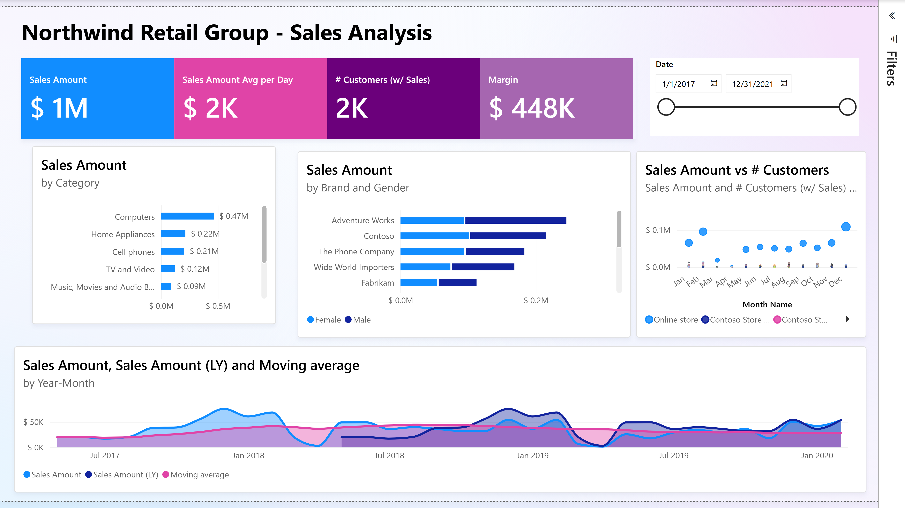
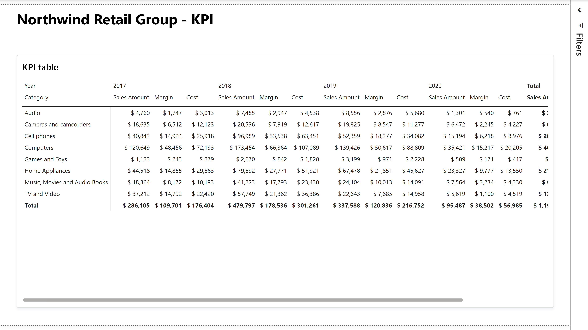

# sales Report

## Overview

The sales report gives Northwind Retail Group analysts an interactive view of net sales, daily performance, customer reach, and margin, followed by a compact financial KPI matrix. It is intended for sales, merchandising, finance, and store-performance review.

| Property | Value |
|---|---|
| Source | `sales.Report/` |
| Semantic model | `sales.SemanticModel/` |
| Pages | 2 |
| Active page | Sales |
| Theme | CopilotDefault (based on Fluent 2) |

## Report Flow

Users begin on Sales, where headline KPIs and a date slicer establish the current context. Product, customer, store, and time visuals then support comparative analysis. The KPI page provides a denser year-by-category view of sales amount, margin, and cost. There are no bookmarks or custom page-navigation buttons; users move between pages with standard report tabs.

## Pages

### Sales

The primary analysis page summarizes current sales performance and provides interactive breakdowns. In the captured Desktop state, the date slicer spans January 2018 through February 2021; runtime selections may differ.

#### Main Metrics

- **Sales Amount**: net sales from quantity multiplied by net price.
- **Sales Amount Avg per Day**: average daily net sales across visible dates.
- **# Customers (w/ Sales)**: distinct purchasing customers in context.
- **Margin**: sales amount less line cost, shown as an absolute amount.

#### Analysis Breakdowns

- **Product category hierarchy**: Sales Amount by Category, Subcategory, and Product in a drillable clustered bar chart.
- **Brand and gender**: Sales Amount by Product Brand with Customer Gender as the series; Product is available as a deeper category level.
- **Store comparison**: scatter chart titled "Sales Amount vs # Customers," using Sales Amount, purchasing-customer count, month, and Store.
- **Monthly trend**: area chart by Year-Month comparing Sales Amount, Sales Amount (LY), and the 12-month average.

#### Available Filters

| Scope | Filter or slicer | Behavior / default |
|---|---|---|
| Page | Calendar Year | Categorical drillthrough field; single selection is required when applied. |
| Page | Product Category | Categorical filter; no persisted selection found. |
| Page | Product Subcategory | Categorical filter; no persisted selection found. |
| Page | Store | Categorical filter; no persisted selection found. |
| Visual | Calendar Year | Applies to the Brand and Gender bar chart; no persisted selection found. |
| Visual | Calendar Date | On-canvas range slicer sorted ascending; captured as Jan 2018–Feb 2021. |

#### Interactions and Navigation

The page is configured for cross-filtering/highlighting between data visuals and enhanced tooltips. It carries a Year drillthrough binding, but no visual-level navigation action or bookmark was found. Selecting chart marks therefore refines the other visuals through standard Power BI interactions.

### KPI

The KPI page provides a compact comparison of financial performance by product category and calendar year. It is useful for scanning the relationship between revenue, cost, and absolute margin across the portfolio.

#### Main Metrics

- **Sales Amount**: net sales by category and year.
- **Margin**: absolute gross margin by category and year.
- **Cost**: extended unit cost by category and year.

#### Analysis Breakdowns

- **Rows**: Product Category.
- **Columns**: Calendar Year.
- **Values**: Sales Amount, Margin, and Cost.

#### Available Filters

No report, page, visual, or slicer filters were found on this page. The captured matrix displays 2017 through 2021.

#### Interactions and Navigation

The page contains only the title and KPI matrix. No bookmarks, drillthrough actions, or custom navigation controls were found.

## Global Filters and Navigation

No report-level filters or persistent cross-page slicers were found. The Sales page filters are page-scoped and do not carry to KPI through the saved definition. Standard Power BI page tabs provide navigation. Enhanced tooltips, inline exploration, visual headers, and cross-highlighting are enabled at report level.

## Validation Notes

The PBIR validator completed with no errors and one warning: the remote JSON schema for `visualContainer/2.12.0` was unreachable, so schema validation for visual files was skipped. Power BI Desktop successfully rendered both pages with populated visuals and no visible error banners, clipping, or overlap.