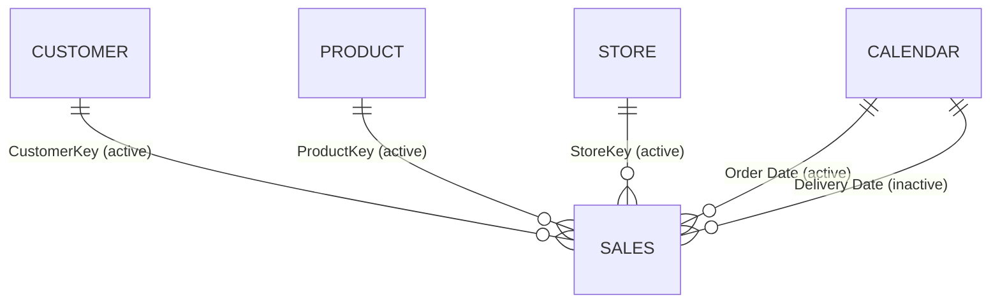

# sales Semantic Model

## Overview

The sales semantic model represents Northwind Retail Group sales order lines and the calendar, product, customer, and store dimensions used to analyze them. It supports revenue, volume, margin, customer reach, product mix, store performance, and time-trend reporting for merchandising, finance, and store operations audiences.

| Property | Value |
|---|---|
| Source | `sales.SemanticModel/` |
| Compatibility level | 1606 |
| Culture | en-US |
| Storage mode(s) | Import |
| Tables | 5 |
| Columns | 63 |
| Measures | 13 |
| Relationships | 5 |

## Model Structure



Sales is the fact table at order-line grain. Each dimension filters Sales through an active one-to-many, single-direction relationship. Calendar filters Sales by Order Date by default; the Delivery Date relationship is inactive, so calculations need `USERELATIONSHIP` to analyze delivery timing.

## Tables and Columns

### Calendar

One row per date from 1 January 2017 through 31 December 2021. It provides calendar and fiscal attributes plus a Year-Month-Day hierarchy.

| Column | Data type | Visibility | Description |
|---|---|---|---|
| Day | Whole number | Visible | Day of month. |
| Month | Whole number | Hidden | Calendar month number. |
| Quarter | Text | Visible | Calendar quarter label. |
| Year | Whole number | Visible | Calendar year. |
| Date | Date/time | Hidden | Date key used by both Sales date relationships. |
| Month Name | Text | Hidden | Abbreviated month name. |
| Year-Month | Date/time | Visible | Month-level reporting value formatted as `mmm yyyy`. |
| Week Number | Whole number | Visible | Week number within the year. |
| Day of Week | Whole number | Visible | Numeric weekday. |
| Day Name | Text | Visible | Full weekday name. |
| Is Weekend | Boolean | Hidden | Flags Saturday and Sunday. |
| Fiscal Year | Whole number | Hidden | Fiscal year generated by the calendar query. |
| Fiscal Quarter | Text | Visible | Fiscal quarter generated by the calendar query. |

The `Year-Month-Day` hierarchy contains Year, Month, and Day levels. The current Power Query logic rolls fiscal years in July, while company context states that NRG's fiscal year starts in February. Consumers should not treat the current fiscal columns as aligned to the documented corporate convention until that logic is reconciled.

### Sales

One row per sales order line, identified by Order Number and Line Number. It contains order and delivery dates, dimension keys, quantity, net price, unit cost, currency information, and workshop environment fields.

| Column | Data type | Visibility | Description |
|---|---|---|---|
| Order Number | Whole number | Visible | Sales order identifier. |
| Line Number | Whole number | Visible | Line sequence within an order. |
| Order Date | Date/time | Visible | Transaction date used by the active Calendar relationship. |
| Delivery Date | Date/time | Visible | Fulfilment date used by the inactive Calendar relationship. |
| CustomerKey | Whole number | Hidden | Foreign key to Customer. |
| StoreKey | Whole number | Hidden | Foreign key to Store. |
| ProductKey | Whole number | Hidden | Foreign key to Product. |
| Unit Cost | Decimal | Hidden | Cost per unit used by Cost and Margin. |
| Currency Code | Text | Visible | Transaction currency code. |
| Exchange Rate | Decimal | Visible | Currency conversion rate supplied by the source. |
| Environment | Text | Visible | Workshop environment label derived from the Environment parameter. |
| Time | Date/time | Visible | Generated transaction time, displayed as long time. |
| Quantity | Whole number | Hidden | Units on the sales line. |
| Net Price | Decimal | Hidden | Net unit selling price after source adjustments. |

### Product

One row per product. It provides product identity, manufacturer and brand, physical attributes, pricing, and category hierarchy attributes.

| Column | Data type | Visibility | Description |
|---|---|---|---|
| Product | Text | Visible | Product name. |
| ProductKey | Whole number | Hidden | Product key used by the Sales relationship. |
| Product Code | Text | Visible | Business product code. |
| Manufacturer | Text | Visible | Product manufacturer. |
| Brand | Text | Visible | Product brand. |
| Color | Text | Visible | Product color. |
| Weight Unit Measure | Text | Visible | Unit used for product weight. |
| Weight | Decimal | Visible | Product weight. |
| Unit Cost | Decimal | Visible | Reference product unit cost. |
| Unit Price | Decimal | Visible | Reference product unit price. |
| Subcategory Code | Text | Visible | Product subcategory code. |
| Subcategory | Text | Visible | Product subcategory. |
| Category Code | Text | Visible | Product category code. |
| Category | Text | Visible | Product category. |

### Customer

One row per customer. It provides identity, demographics, address geography, birthday, and a calculated current age.

| Column | Data type | Visibility | Description |
|---|---|---|---|
| CustomerKey | Whole number | Hidden | Customer key used by the Sales relationship. |
| Gender | Text | Visible | Customer gender classification. |
| Customer | Text | Visible | Customer name. |
| Address | Text | Visible | Street address. |
| City | Text | Visible | Customer city. |
| State Code | Text | Visible | State or province code. |
| State | Text | Visible | State or province name. |
| Zip Code | Text | Visible | Postal code. |
| Country Code | Text | Visible | Country code. |
| Country | Text | Visible | Full country name. |
| Continent | Text | Visible | Customer continent. |
| Birthday | Date/time | Visible | Date of birth. |
| Age | Calculated whole number | Visible | Whole years between Birthday and the refresh/query date. |

### Store

One row per store. It supports geographic, footprint, opening/closure, and operating-status analysis.

| Column | Data type | Visibility | Description |
|---|---|---|---|
| StoreKey | Whole number | Hidden | Store key used by the Sales relationship. |
| Store Code | Text | Visible | Business store code. |
| Country | Text | Visible | Store country. |
| State | Text | Visible | Store state or province. |
| Store | Text | Visible | Store name. |
| Square Meters | Whole number | Visible | Store selling-area footprint. |
| Open Date | Date/time | Visible | Store opening date. |
| Close Date | Date/time | Visible | Store closing date when applicable. |
| Status | Text | Visible | Current store operating status. |

## Measures

All measures respond to the active report filter context. Time-intelligence measures use Calendar through the active Order Date relationship unless their DAX explicitly changes it.

### Sales Amount

Net sales revenue, calculated as quantity multiplied by net unit price for each visible sales line. This is the model's closest implementation of the company definition of Revenue.

```dax
SUMX('Sales', 'Sales'[Quantity] * 'Sales'[Net Price])
```

### Sales Qty

Total individual product units sold in the current filter context.

```dax
SUM('Sales'[Quantity])
```

### Cost

Total line cost, calculated from quantity and unit cost.

```dax
SUMX(Sales, Sales[Quantity] * Sales[Unit Cost])
```

### Margin

Absolute gross margin amount: net sales less unit cost, extended by quantity. It is an amount rather than a margin percentage.

```dax
SUMX(
    Sales,
    Sales[Quantity] * (Sales[Net Price] - Sales[Unit Cost])
)
```

### # Sales

Counts sales order lines, not distinct orders or customer baskets.

```dax
COUNTROWS('Sales')
```

### # Customers (w/ Sales)

Distinct customers represented by visible sales lines. Unlike `# Customers`, this count is constrained to customers with sales in the current context.

```dax
DISTINCTCOUNT('Sales'[CustomerKey])
```

### Sales Amount Avg per Day

Average daily sales amount across the visible Calendar dates. Dates without sales contribute a blank rather than an explicit zero.

```dax
AVERAGEX(VALUES('Calendar'[Date]), [Sales Amount])
```

### Sales Amount (LY)

Sales amount for the same calendar period one year earlier. It returns blank when current-period Sales Amount is not positive.

```dax
IF(
    [Sales Amount] > 0,
    CALCULATE([Sales Amount], SAMEPERIODLASTYEAR('Calendar'[Date]))
)
```

### Sales Amount (6M average)

Daily average Sales Amount over the six-month period ending on the latest visible date. The measure suppresses output when its period does not overlap the model's last order date.

```dax
VAR v_selDate = MAX('Calendar'[Date])
VAR v_period = DATESINPERIOD('Calendar'[Date], v_selDate, -6, MONTH)
VAR v_result =
    CALCULATE(AVERAGEX(VALUES('Calendar'[Date]), [Sales Amount]), v_period)
VAR v_firstDate = MINX(v_period, 'Calendar'[Date])
VAR v_lastDateSales = MAX(Sales[Order Date])
RETURN
    IF(v_firstDate <= v_lastDateSales, v_result)
```

### Sales Amount (12M average)

Daily average Sales Amount over the twelve-month period ending on the latest visible date, with the same overlap guard as the six-month measure.

```dax
VAR v_selDate = MAX('Calendar'[Date])
VAR v_period = DATESINPERIOD('Calendar'[Date], v_selDate, -12, MONTH)
VAR v_result =
    CALCULATE(AVERAGEX(VALUES('Calendar'[Date]), [Sales Amount]), v_period)
VAR v_firstDate = MINX(v_period, 'Calendar'[Date])
VAR v_lastDateSales = MAX(Sales[Order Date])
RETURN
    IF(v_firstDate <= v_lastDateSales, v_result)
```

### # Products

Counts rows in Product. Product filters affect the count; Sales filters do not flow back to Product through the single-direction relationship.

```dax
COUNTROWS('Product')
```

### # Customers

Counts rows in Customer. This is the dimension population, not necessarily customers with transactions.

```dax
COUNTROWS('Customer')
```

### # Stores

Counts rows in Store. This includes all visible stores regardless of sales activity unless Store itself is filtered.

```dax
COUNTROWS('Store')
```

## Security

No row-level security roles, object-level security roles, or perspectives were found. This does not implement the company convention of country-restricted access for regional managers.

## Data Sources and Refresh

All five tables use Import partitions. Sales, Product, Customer, and Store read CSV files from the `HttpSource` Power Query parameter, currently a public GitHub raw-content path for workshop sample data. Calendar is generated in Power Query with a fixed 2017–2021 date range.

| Parameter | Current value | Purpose |
|---|---|---|
| HttpSource | `https://raw.githubusercontent.com/RuiRomano/workshop-fabcon-26-bcn/main/resources/sample-data/` | Base URL for source CSV files. |
| Environment | `DEV` | Environment selector with DEV, QUAL, and PRD options. |
| Randomizer | `0.6` | Controls random variation applied by the Sales query. |

Refresh requires network access to the public source URL. The Sales query generates time and adjusted values using random functions, so repeated refreshes may not reproduce identical sample results. The fixed Calendar end date also means later transactions would not be covered without extending the query.
