# Lab - Personalized Power BI Agents

⏱️ **Total duration:** 90 minutes

## Overview

In this lab you learn how to use a personalized agentic Power BI development using [GitHub Copilot](https://github.com/copilot) and Power BI agentic tools.

The lab covers the two scenarios you meet in real projects:

- **Brownfield development.** You inherit an existing Power BI report, convert it to a PBIP project, track it with Git, and use AI agents to help you with development tasks.
- **Greenfield development.** You start from a Fabric Lakehouse, and let the agent plan and build a new semantic model and reports with you steering the implementation.

Both parts use the shared prerequisites and environment setup. After completing that setup, you can work through either part independently.

## What you will learn

- How to install and use the `powerbi-authoring` plugin across multiple harnesses: GitHub Copilot CLI, Visual Studio Code, and the GitHub Copilot app
- How PBIP and Git let you track, review, and revert AI-generated changes
- How an `AGENTS.md` file constrains agent behavior and reduces hallucinations
- How to feed company context and team standards to an agent as versioned team shareable files
- How to generate and maintain documentation for a semantic model and a report
- How to modify an existing semantic model and report using AI and Power BI agentic skills and tools
- How to plan before implementing, and how to choose a model for each phase
- How to use the remote Power BI Authoring MCP server with no local setup
- How to run parallel subagents to scale with different implementation variations

## Lab structure

| Section                                                                                                                    | Learning goal                                       |
| -------------------------------------------------------------------------------------------------------------------------- | --------------------------------------------------- |
| [Prerequisites](#prerequisites)                                                                                            | Confirm tools, licenses, and access                 |
| [Prepare the environment](#prepare-the-environment)                                                                        | Install the plugin and sign in to the required CLIs |
| **[Part 1: Brownfield development](#part-1-brownfield-development)**                                                       | **Develop an existing Power BI project**            |
| [1.1 Save the report as a PBIP project and track it with Git](#11-save-the-report-as-a-pbip-project-and-track-it-with-git) | Create a reviewable baseline                        |
| [1.2 Prepare the codebase with agentic context](#12-prepare-the-codebase-with-agentic-context)                             | Add `AGENTS.md` and a local skill to the project    |
| [1.3 Generate documentation for the model and report](#13-generate-documentation-for-the-model-and-report)                 | Automate a task nobody enjoys                       |
| [1.4 Add measure descriptions using company context](#14-add-measure-descriptions-using-company-context)                   | Ground the agent in business language               |
| [1.5 Add currency conversion with a calculation group](#15-add-currency-conversion-with-a-calculation-group)               | Extend the semantic model                           |
| [1.6 Restyle the report pages](#16-restyle-the-report-pages)                                                               | Apply report-wide layout changes                    |
| **[Part 2: Greenfield development](#part-2-greenfield-development)**                                                       | **Build new Power BI artifacts in Fabric**          |
| [2.1 Prepare the Fabric Lakehouse](#21-prepare-the-fabric-lakehouse)                                                       | Create the greenfield data source                   |
| [2.2 Connect the GitHub Copilot app to the remote MCP server](#22-connect-the-github-copilot-app-to-the-remote-mcp-server) | Work without local setup                            |
| [2.3 Plan and build a Direct Lake semantic model](#23-plan-and-build-a-direct-lake-semantic-model)                         | Plan first, then implement                          |
| [2.4 Create two reports with parallel subagents](#24-create-two-reports-with-parallel-subagents)                           | Compare design variations in parallel               |

## Prerequisites

Before you begin, complete the [workshop prerequisites](../pre-requisites.md). That guide includes installation instructions and account setup.

This lab requires the following:

* GitHub Copilot CLI
* GitHub Copilot app
* Power BI Desktop
* Visual Studio Code
* Git for Windows
* Node.js and npm
* Azure CLI
* A GitHub Copilot license
* A Fabric account with access to Fabric capacity and permission to create a workspace

## Prepare the environment

✅ **Goal**: Install the Power BI authoring plugin once and make it available to every GitHub Copilot surface, then sign in to the accounts the agent needs.

### Install the Power BI authoring plugin

1. Open a terminal.
2. Run the following commands:

	```powershell
	copilot plugin marketplace add microsoft/skills-for-fabric	
	```
	```powershell	
	copilot plugin install powerbi-authoring@fabric-collection
	```

> [!TIP]
> There are several ways to install skills and plugins. You can install them in Visual Studio Code, using [NPX Skills](https://github.com/vercel-labs/skills), [Agent Package Manager](https://microsoft.github.io/apm/) or simply copy them into your workspace or Copilot folder. Installing the plugin through GitHub Copilot CLI is a simple way to make its skills and MCP server available across GitHub Copilot CLI, Visual Studio Code, and the GitHub Copilot app without installing duplicate copies.
>
> Learn more in [`powerbi-authoring-plugin`](https://learn.microsoft.com/en-us/power-bi/developer/agentic/power-bi-agentic-overview#get-started) documentation page.

### Sign in to GitHub Copilot

1. Start GitHub Copilot CLI:

	```powershell
	copilot
	```

2. Sign in to your GitHub Copilot account:

	```text
	/login
	```

    If asked for account type, choose **GitHub.com**
    
3. Follow the browser prompts and return to the terminal when the sign-in completes.
   
    Your console should look like this:

    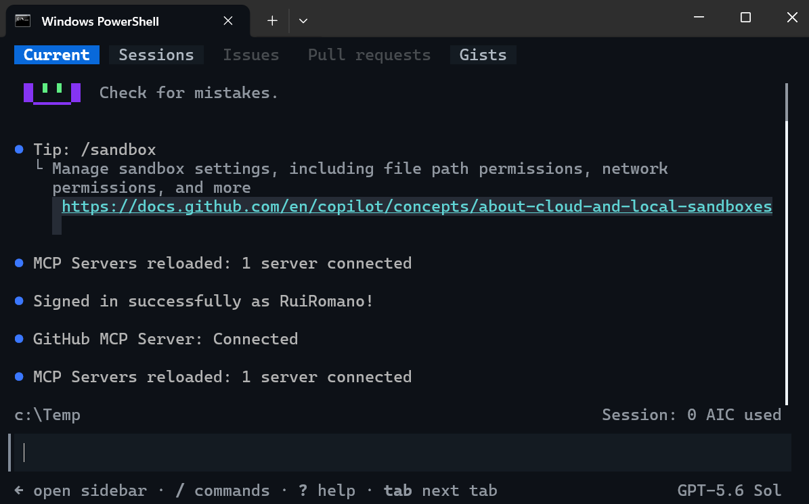

### Confirm that the skills and MCP server are ready

1. In the GitHub Copilot CLI session, enter the following prompt:

	```text
	List the Power BI skills and MCP servers you have available.
	```

	**Expected outcome**

	- The response lists the Power BI authoring skills that came with the plugin, including `semantic-model-authoring` and `powerbi-report-authoring`.
	- The response lists the Power BI Authoring MCP server as available.
	- If either list is empty, the plugin installation did not complete. Re-run the plugin install commands before continuing.

### Sign in to Azure CLI

1. Open a terminal.
2. Sign in with your Fabric account:

	```powershell
	az login
	```
3. Follow the browser prompts and return to the terminal when the sign-in completes.
3. Confirm that the correct account is active

	```powershell
	az account show
	```
	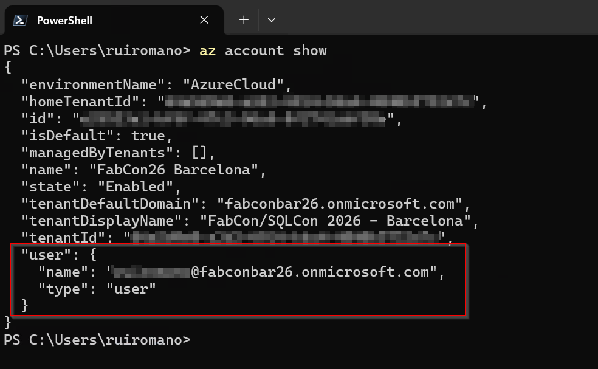

> [!IMPORTANT]
> The Power BI report authoring tools use the Azure CLI token to reach Fabric. If the wrong account is active, later exercises fail with authorization errors.

### Ensure GitHub Copilot is enabled in Visual Studio Code

1. Open **Visual Studio Code**.
2. Select [Open the AI features setting](vscode://settings/chat.disableAIFeatures) and ensure that **Disable AI Features** is cleared.
	- **Note:** If the link does not open from your Markdown viewer, open **Settings** in Visual Studio Code and search for `chat.disableAIFeatures`.
3. Open **GitHub Copilot Chat** (`CTRL+ALT+I`) and confirm that the chat view is accessible.
4. You may need to sign-in with your GitHub Copilot account.
5. Open the chat settings and confirm the `powerbi-authoring` plugin is intalled
   
	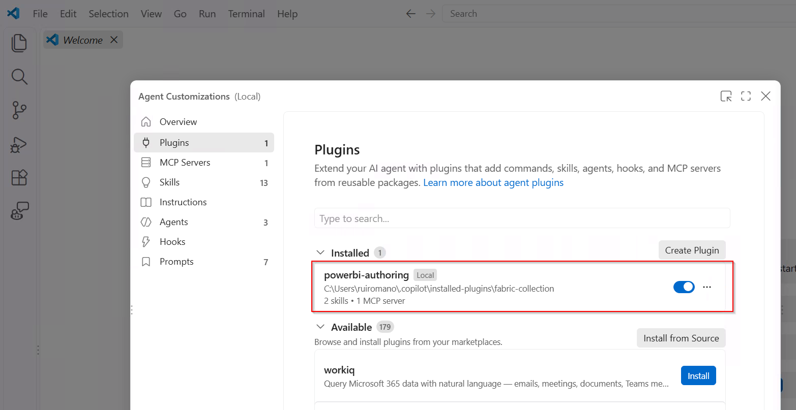

### Expected result

You should now have:

* A signed-in GitHub Copilot CLI session
* A signed-in Visual Studio Code Copilot chat
* The `powerbi-authoring` plugin installed and shared across GitHub Copilot surfaces
* Confirmation that the Power BI skills and MCP server are available
* Azure CLI signed in with the workshop Fabric account


---

## Part 1: Brownfield development

In this part you work with an existing Power BI report. You convert it to PBIP, place it under Git, and use an AI Agent inside Visual Studio Code to document and make changes to it. Power BI Desktop stays open so you can reload and inspect the agent's changes.

### 1.1 Save the report as a PBIP project and track it with Git

✅ **Goal**: Convert a provided PBIX file into a PBIP project and create a Git baseline so that every agent change is reviewable and reversible.

#### Steps

1. Open the workshop [`resources/sales.pbix`](resources/sales.pbix) file in **Power BI Desktop**.
2. Select **File** > **Save as** > **Browse this device**.
3. Choose a local folder for the lab, for example `C:\FabCon\Lab2_Par1`.
4. In the file type list, select **Power BI project files (*.pbip)** and save the project.
5. Keep Power BI Desktop open. You reload changes from it later in the lab.
6. Open the project folder in **Visual Studio Code** by clicking the title bar and choosing **Open in Visual Studio Code**
   
	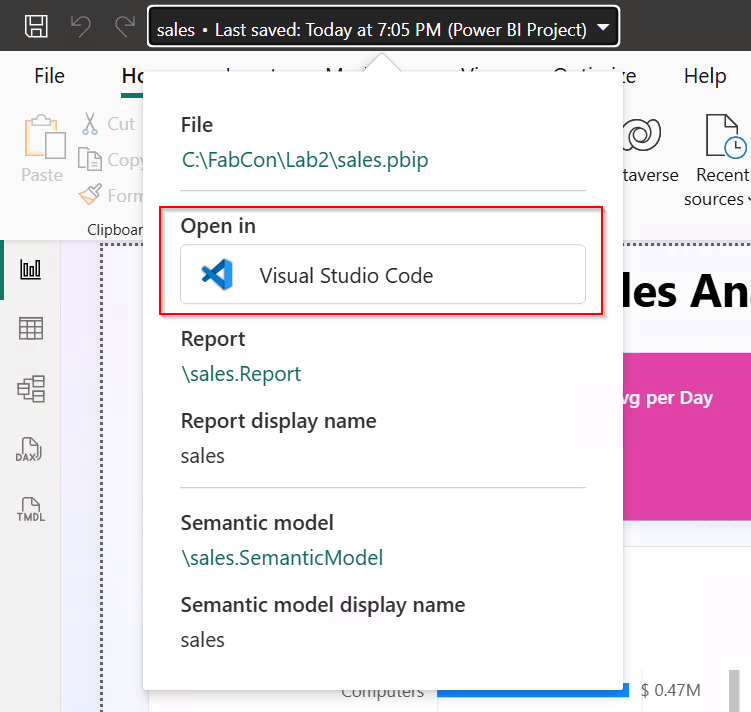

   Confirm that the folder contains the `sales.SemanticModel` and `sales.Report` folders.

	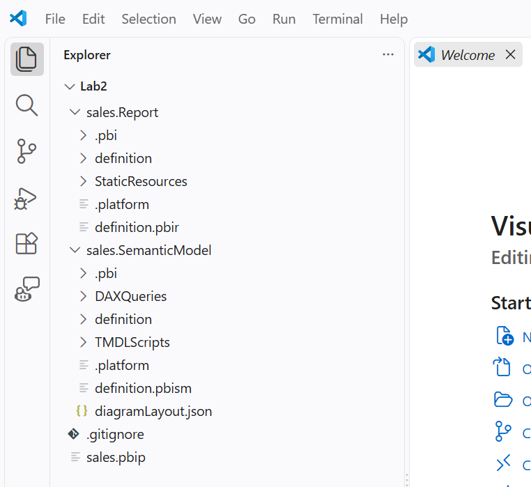

8. Click the **Source Control** (`CTRL+SHIFT+G`) tab and select **Initialize Repository**
9. Type a initial commit message, for example "Initial PBIP baseline"

	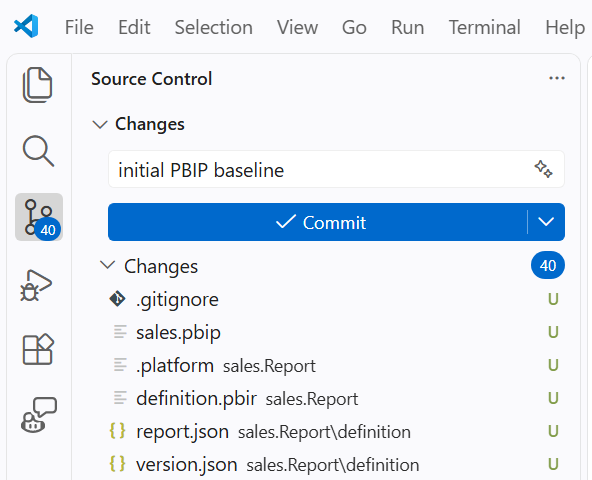

> [!IMPORTANT]
> PBIP stores the semantic model as TMDL files and the report as PBIR files. Both are plain text, so Git can show you exactly what the agent changed. This is your safety net: review the diff after every prompt, keep what you want, and discard the rest with **Discard changes** in the Source Control view.    	

#### Expected result

* A PBIP project saved to a local folder
* `sales.SemanticModel` and `sales.Report` folders visible in Visual Studio Code
* An initialized Git repository with a clean working tree and one baseline commit

### 1.2 Prepare the codebase with agentic context

✅ **Goal**: Add versioned instructions and a local skill so agents understand how to work with this codebase before you enter the first prompt.

#### Steps

1. Copy [resources/AGENTS.md](resources/AGENTS.md) from the workshop repository into the root of your PBIP project folder.

> [!IMPORTANT]
> [`AGENTS.md`](https://agents.md/) is an important part of agentic development. It lets you define codebase-level rules, context, and constraints that agents need to understand and respect when working on the project. Because the file is stored with the codebase and read automatically, the same guidance applies consistently across chat sessions and team members.
>
> The `AGENTS.md` file in this workshop is a simple example. It ensures that the agent always loads the appropriate Power BI authoring skills and directs it to use the Power BI Authoring MCP server when editing the semantic model. The agent can work with TMDL files directly, but using the MCP tools provides a more reliable authoring path less likely to break things.

2. Copy the folder [`resources/.github`](resources/.github) into the root of your PBIP project folder.

> [!IMPORTANT]
> This workshop uses Microsoft-provided agent skills installed through the `powerbi-authoring` plugin. Skills give the agent context about processes and preferred ways of working. Teams can keep project-specific skills in source control to capture business practices and help developers produce consistent results. The [`powerbi-documentation` skill](resources/.github/skills/powerbi-documentation/SKILL.md) is an example of a repository-local skill that lives alongside the codebase. Skills can also be shared through private or public repositories and marketplaces.

3. Confirm that your folder looks like this:

	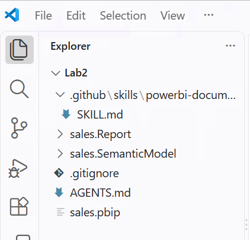

4. Open **Source Control** (`CTRL+SHIFT+G`) and commit the new files.

> [!TIP]
> You can use Copilot to generate analyze the changes and generate the commit message for you by clicking on **Generate commit message** in the top right corner of the textbox.

#### Expected result

* `AGENTS.md` present in the project root with the development rules agents should follow
* The local `powerbi-documentation` skill available under `.github/skills/`
* Both sources of agentic context committed to Git and shared with the codebase

### 1.3 Generate documentation for the model and report

✅ **Goal**: Let the agent produce the documentation that usually never gets written, using the PBIP files as the source of truth.

Writing documentation from scratch and keeping it current both take time. AI can help you create a useful starting point, while the Power BI agentic tools, the MCP server, and the `powerbi-desktop` CLI can help keep it aligned with the model and report with minimal ongoing effort.

#### Steps

1. In **Visual Studio Code**, open **GitHub Copilot Chat** (`CTRL+ALT+I`).
2. Set the chat mode to **Agent**.
3. In the model picker, select a reasoning model such as `GPT-5.6 Sol`.

	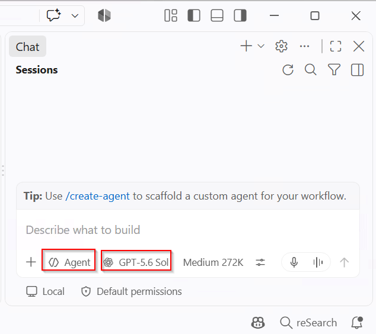

4. Enter the following prompt:

	```text
	Document this Power BI Project code base.
	```

	**Expected outcome**

	- The agent reads `AGENTS.md` and loads the local `powerbi-documentation` skill. LLMs load skills on demand, and the instruction in `AGENTS.md` makes this requirement explicit.
	- The agent follows the documentation structure and standards defined by the `powerbi-documentation` skill.
	- The agent uses the Power BI Authoring skill and MCP server to inspect the semantic model metadata.
	- The agent loads the Power BI report authoring skills to inspect the PBIR files and understand the report pages, visuals, filters, and bindings.
	- The agent uses the Power BI report CLI tools to capture screenshots from the report open in Power BI Desktop.
	- A `docs/` folder is created with a catalog and one Markdown file for each semantic model and report in the codebase.
	- The generated documentation includes the model structure, measures, report flow, filters, and a screenshot of every report page.

> [!IMPORTANT]
> The short prompt works because `AGENTS.md` requires the agent to load the local `powerbi-documentation` skill. The skill defines how the team expects project documentation to be created, while the Power BI MCP server and report tools provide the model and report information needed to create it.
>
> By default, each tool call asks for your approval. You can approve calls individually, allow tools for the current session or all sessions, or switch the agent to **Autopilot**. Autopilot runs tools without asking for approval, so use it carefully and preferably in a sandbox environment. For details, see [Manage approvals and permissions](https://code.visualstudio.com/docs/agents/run/approvals).

5. Open the generated documentation Markdown files in `docs/` and preview them with **Ctrl+Shift+V**.
6. Open the **Source Control** (`CTRL+SHIFT+G`) and commit all changes.

#### Reflection

* How much time would you need to produce the same level of documentation for one of your own semantic models?
* Which documentation standards would your team add to or remove from the `powerbi-documentation` skill?
* Which parts of the generated documentation still need a human to verify?

### 1.4 Add measure descriptions using company context

✅ **Goal**: Add business-friendly descriptions to every measure, written in the language of Northwind Retail Group rather than generic BI text.

#### Steps

1. Copy [resources/company-context.md](resources/company-context.md) from the workshop repository into the root of your PBIP project folder.
2. Start a **new chat session** in GitHub Copilot Chat.

> [!TIP]
> Start a new session when moving to a different task. A clean session prevents decisions, assumptions, and tool results from the previous task from influencing the next one. 
>
> You can also reuse an existing sessions to keep the session context. For example, you could reuse the documentation session to update the docs after making changes to the semantic models or reports.

3. Choose a lower-cost model such as `GPT-5.6 Terra`.
   
> [!TIP]
> Choose the model that fits the task. Generating measure descriptions still benefits from a reasoning model because it must interpret DAX and business context, but it does not require the most capable or expensive option. Reserve higher-cost models for work that needs deeper planning or more complex decisions.

4. Enter the following prompt:

	```text
	Add a description to every measure in the semantic model `Sales.SemanticModel\definition`.
	Use `company-context.md` for tone and business context so descriptions sound like they come from someone at Northwind Retail Group, not generic BI text.
	Keep each description to 1-2 sentences: what the measure calculates, and any business nuance from the context (e.g. net vs. gross, fiscal year, seasonality) where relevant.
	```

	**Expected outcome**

	- The agent loads the `semantic-model-authoring` skill.
	- The agent connects to the semantic model TMDL files through the Power BI Authoring MCP server instead of editing TMDL files by hand.
	- Every measure receives a concise description of one to two sentences.
	- The descriptions reflect the context file, for example revenue described as net sales, fiscal years labeled FY24 or FY25, and seasonal patterns called out where they are relevant.
	- The updated model is saved back to the PBIP folder.
	- No measure expressions, data types, or relationships are changed.

> [!TIP]
> There is little difference between `company-context.md` and the context contained in a skill. The company context could be packaged as a skill. This exercise keeps it as a regular file to show that you can also give an agent context by referring to a file directly in your prompt.

5. Open the **Source Control tab** in Visual Studio Code (`CTRL+SHIFT+G`) and review the Git diff to the semantic model TMDL code files. Confirm that the changed lines are description properties only, and that no DAX expression was modified.
    
    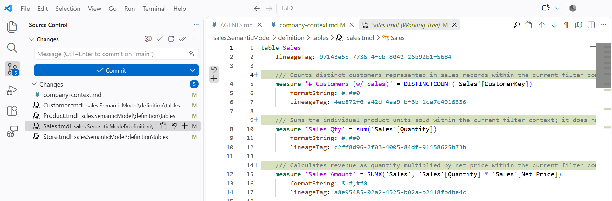

> [!TIP]
> This is the main advantage of PBIP with Git. You see the exact change before you accept it.

6. Switch to **Power BI Desktop**.
7. Select **Apply external changes** to reload the updated model.
   
   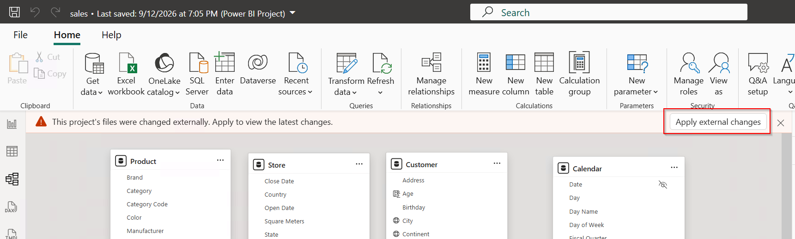

> [!TIP]
> **Apply external changes** shipped with the August 2026 Power BI Desktop release. It detects and reloads PBIP files changed outside Power BI Desktop, whether those changes were made manually in Visual Studio Code or generated by AI agents and tools. Learn more in [Edit Power BI Desktop project files in Visual Studio Code](https://learn.microsoft.com/en-us/power-bi/developer/projects/projects-external-editing).

8. Select a measure in the model view and confirm that its description appears in the properties pane.
9. Open **Source Control** (`CTRL+SHIFT+G`) and commit the changes.

#### Reflection

* Which descriptions would you keep as written, and which would you rewrite? Could you include context in `AGENTS.md` or `company-context.md` to make it better?
* What other team knowledge would be worth storing as a context file in the repository?

### 1.5 Add currency conversion with a calculation group

✅ **Goal**: Extend the semantic model with a new source table and a calculation group so sales can be analyzed in multiple currencies.

#### Steps

1. Start a **new chat session** and pick `GPT-5.6 Terra` model.
2. Enter the following prompt:

	```text
	Add RAW-CurrencyExchange.csv (https://raw.githubusercontent.com/pbi-tools/sales-sample/refs/heads/data/RAW-CurrencyExchange.csv) to the `sales.SemanticModel\definition` semantic model, then create a calculation group to convert and analyze sales in EUR, USD, and GBP.
	```

	**Expected outcome**

	- The agent loads the `semantic-model-authoring` skill.
	- The agent inspects the CSV file to determine its schema before creating anything.
	- The agent uses the Power BI Authoring MCP server to create the currency exchange table and the calculation group.
	- The calculation group contains calculation items for EUR, USD, and GBP.
	- The updated model is saved back to the PBIP folder.
	- The Git diff shows new TMDL files for the table and the calculation group, and no unrelated model changes.

3. Open **Source Control** (`CTRL+SHIFT+G`) and review the Git diff.
4. Switch to **Power BI Desktop** and select **Apply external changes**.
5. **Refresh** the model in **Power BI Desktop**
6. Create a temporary visual with a sales measure, then apply the calculation group items to confirm that the converted values change as expected.
   
   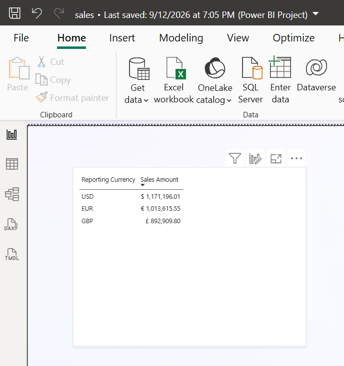

7. Open **Source Control** (`CTRL+SHIFT+G`) and commit the changes.

#### Reflection

* Notice how the agent fetched a new data source, inspected its schema, and translated it into semantic model definitions.

### 1.6 Restyle the report pages

✅ **Goal**: Apply a consistent layout across every page of the report through the report authoring tools.

#### Steps

1. Open the "Sales" report page in **Power BI Desktop** and observe the visual positioning and size is not consistent.

    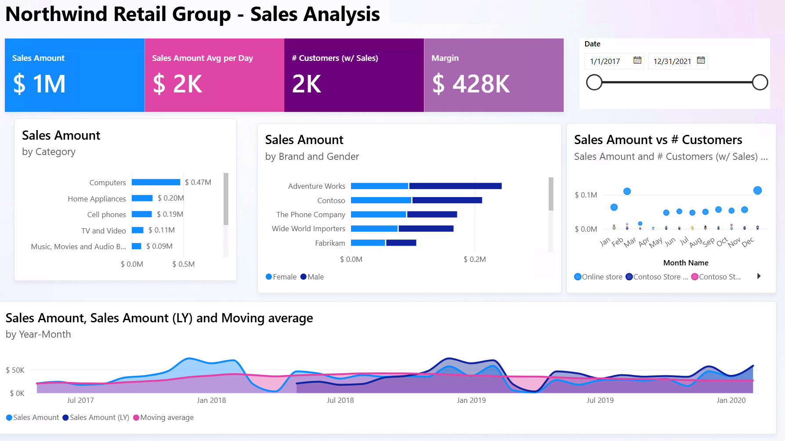

2. Start a **new chat session** and pick model `GPT-5.6 Terra`.

3. Optionally turn on **Autopilot** in the chat session so the agent runs the sequence of tool calls without asking for approval at every step.

	> **Note:** Autopilot is useful for long, repetitive tool sequences, but use it with care. The agent acts without asking. Keep your Git working tree clean before you enable it so you can always revert.

4. Enter the following prompt to use AI to help you make changes to the report.

	```text
	Remove visual titles on all visuals of all pages in report `Sales.Report`.
    Ensure the grid layout of the report is consistent in terms of visual alignment and size:
    - Visual alignment between the grid rows
    - Spacing between visuals should be consistent
    - Visuals below the cards and slicers should have the same size on each grid row.
    Note: If CLI reports `hasUnsavedChanges=true` overwrite and continue with the reload for the screenshot validation.
	```

	**Expected outcome**

	- The agent loads the `powerbi-report-authoring` skill.
	- The agent reads and modify the PBIR *.json files
	- The agent uses both the `powerbi-report-author` to validate schema changes and `powerbi-desktop` CLI tools to reload and screenshot in **Power BI Desktop** for validation.

> [!IMPORTANT]
> The agent might refuse to reload the report if the Power BI Desktop CLI reports `unsavedChanges`. This usually means that Power BI Desktop contains changes that have not been saved to the PBIP files. Stopping prevents the agent from overwriting your work. In this exercise we know that agent is the only one modifying the report and because of that we state explicitly in the prompt that it can proceed despite the warning.

5. Open **Source Control** and review the Git diff - only report files should have changed.
6. Switch to **Power BI Desktop** and confirm that titles are removed and the visuals are aligned.
   
    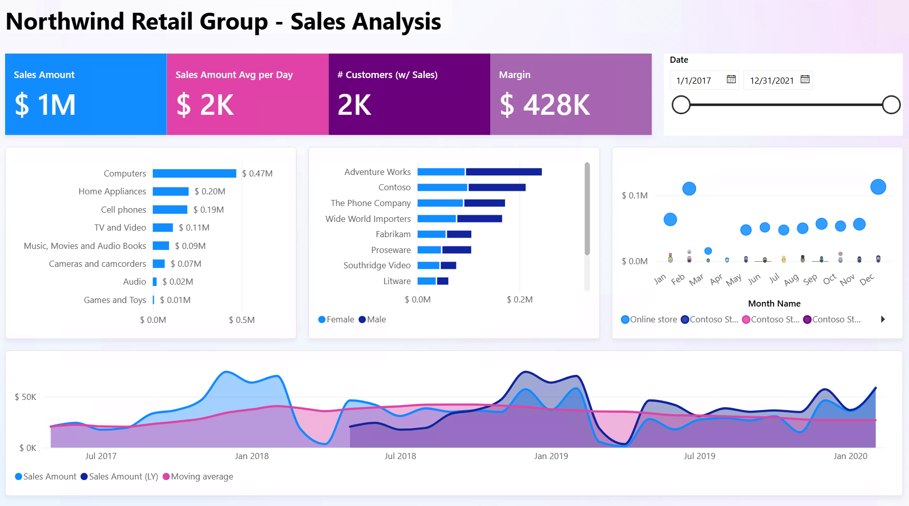

7. Open **Source Control** (`CTRL+SHIFT+G`) and commit the changes.

#### Reflection

* This example makes a simple change to two report pages, but the same approach can scale to larger reports or multiple reports.
* You could capture your team's layout and design standards as agentic context, then use agents to review reports against those standards autonomously.
* Power BI CLI tools let the agent validate the PBIR JSON changes and use screenshots from Power BI Desktop to confirm that the rendered report matches the intended result.

---

## Part 2: Greenfield development

In this part you start from nothing. You create a Fabric workspace, load a Lakehouse with a notebook, and then build a Direct Lake semantic model and two reports from the **GitHub Copilot app** using the remote Power BI Authoring MCP server.

There are no local files in this part. The **GitHub Copilot app** is a good fit for that: it is more approachable than Visual Studio Code or the CLI. Underneath it is the same GitHub Copilot orchestrator, the same skills, and the same MCP capabilities, so the experience stays consistent. Which surface you use is a matter of preference.

> [!IMPORTANT]
> Run the following in the terminal before starting this part:
```
npx skills add https://github.com/azure-data-intelligence-platform/pbi-report-authoring-skill --skill powerbi-report-authoring powerbi-report-design powerbi-report-management powerbi-report-planning -y -a github-copilot
```

### 2.1 Prepare the Fabric Lakehouse

✅ **Goal**: Create an isolated Fabric workspace and load it with a Lakehouse containing the sample sales tables.

#### Steps

1. Go to [Power BI](https://app.powerbi.com) and sign in with the workshop account.
2. Select **Workspaces** > **New workspace**.
3. Name the workspace using this convention:

	```text
	FabCon-Agentic-Lab2-[YourInitials]
	```

4. Assign the workspace to the avaiable Fabric/Premium capacity and select **Apply**.
5. In the new workspace, select **New item** > **Notebook**.
6. Open [resources/notebook.py](resources/notebook.py) from the workshop repository and copy its contents.
7. Paste the code into the first cell of the notebook.
8. Run the notebook (`CTRL+ENTER`) and wait for it to finish.
   
	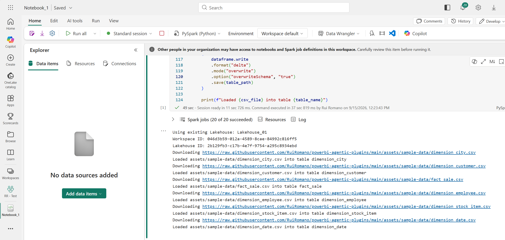

9. Refresh the workspace and confirm that a Lakehouse named `Lakehouse_01` was created.
10. Open the Lakehouse and confirm that it contains the following tables:

	* `dimension_city`
	* `dimension_customer`
	* `dimension_date`
	* `dimension_employee`
	* `dimension_stock_item`
	* `fact_sale`

	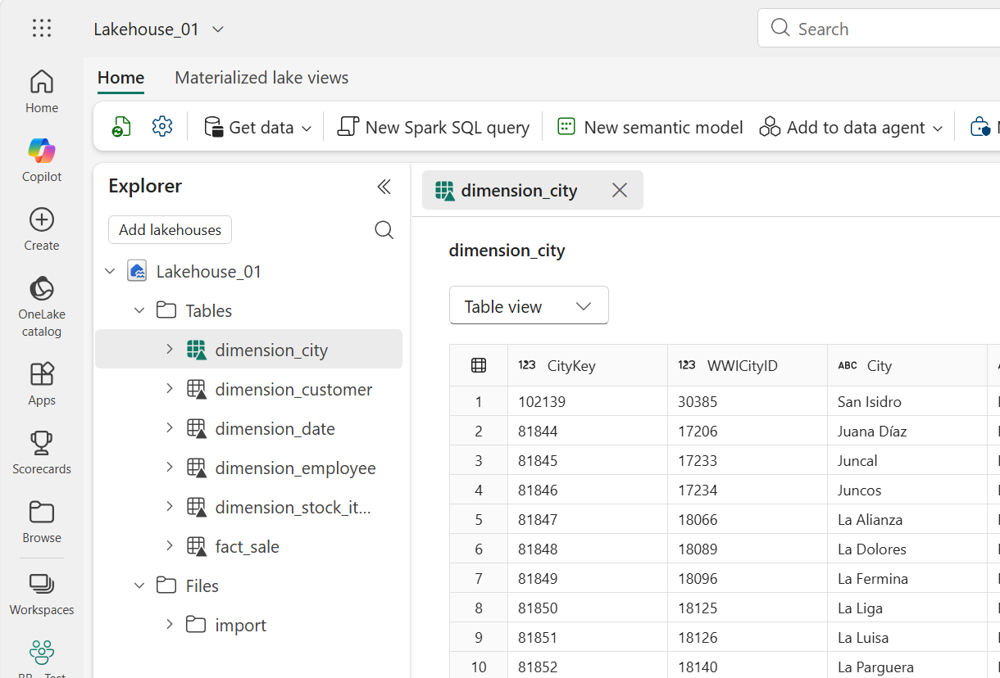

#### Expected result

* A dedicated Fabric workspace named `FabCon-Agentic-Lab2-[YourInitials]`
* A `Lakehouse_01` Lakehouse loaded with the tables.

### 2.2 Connect the GitHub Copilot app to the remote MCP server

✅ **Goal**: Register the remote Power BI Authoring MCP server so the agent can work against Fabric semantic models with no local installation.

#### Steps

1. Open the **GitHub Copilot app** and sign in with your GitHub account.
2. Click on **Customize** > **MCP** > **Add server** > **Custom server** and configure the Power BI Authoring MCP server using the HTTP configuration.

	```text
	server name: powerbi-authoring-remote
	url: https://api.fabric.microsoft.com/v1/mcp/powerbi/authoring
	```

	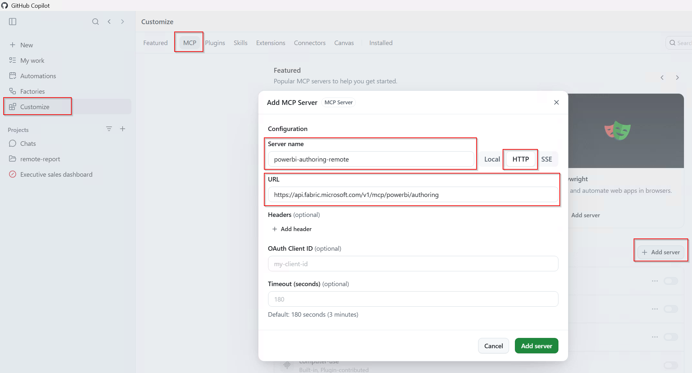

3. Complete the authentication prompt with the workshop Fabric account.
4. Disable the local MCP from the `powerbi-authoring` plugin. 

	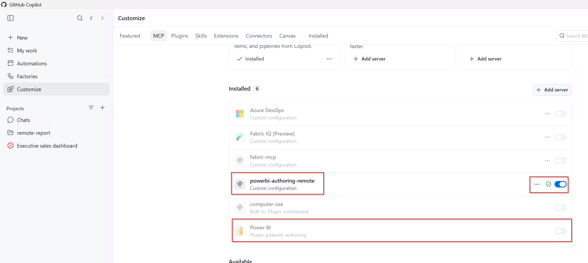

> [!IMPORTANT]
> The local Power BI Authoring MCP server installed by default with `powerbi-authoring` plugin provides the same capabilities and is generally available. The remote MCP server is currently in preview and is intended to become the default option for working with Fabric data sources because its hosted in Fabric and requires no local instalation.
>
> You should avoid enabling both local and remote servers at the same time. The agent then sees two overlapping tool sets, which makes routing ambiguous and consumes extra tokens on every request. Pick one: the hosted server when you work against semantic models in Fabric workspaces, and the local server when you work against Power BI Desktop or Power BI Project files on your machine.

#### Expected result

* The remote Power BI Authoring MCP server registered and authenticated in the GitHub Copilot app

### 2.3 Plan and build a Direct Lake semantic model

✅ **Goal**: Produce a reviewed implementation plan for a new Direct Lake semantic model, then implement the approved plan with a cheaper model.

Planning first gives you something to correct before anything is created. It also lets you split the work: an expensive reasoning model for the thinking, a cheaper model for the execution.

#### Create the plan

1. Create a new empty folder in your laptop, e.g. `C:\FabCon\Lab2_Part2`
2. In the **GitHub Copilot App**, select **+** > **Open folder** 
   
	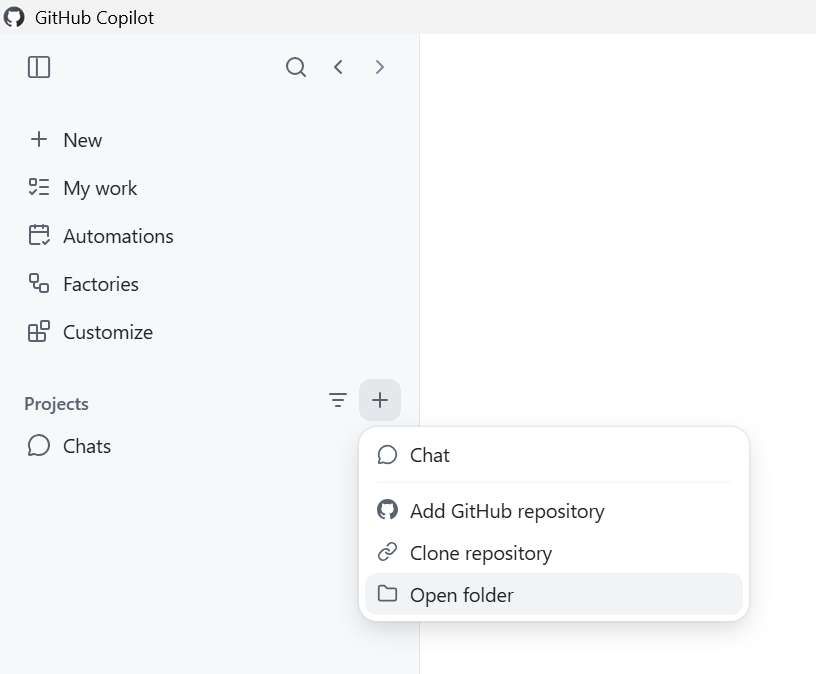

> [!TIP]
> You can start a chat without a working folder, but opening a dedicated folder allows you to personalize settings to sessions under this folder such as configure context files such as `AGENTS.md` or MCP servers.

3. Click on **New session** under the working folder, set the session mode to **Plan** and pick a powerful model such as `GPT-5.6 Sol`.
	
	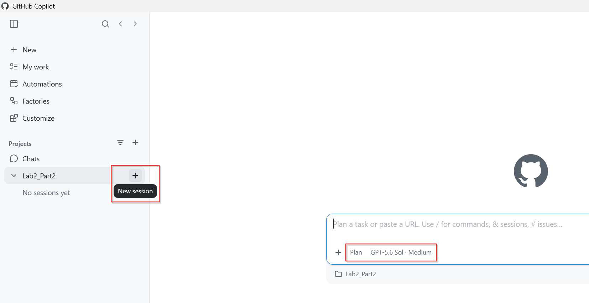	

> [!TIP]
> **Plan** mode lets Copilot inspect the available context, ask clarifying questions, and propose a reviewable implementation approach before making changes. You can correct assumptions, add validation steps, and agree on the scope before handing the plan to an agent for implementation. This is especially useful for complex or unfamiliar projects, where fixing the plan is cheaper than undoing the implementation. Learn more in [Use the GitHub Copilot plan agent](https://learn.microsoft.com/en-us/visualstudio/ide/copilot-plan-agent?view=visualstudio).

3. Add [resources/team-rules.md](resources/team-rules.md) file as context.

	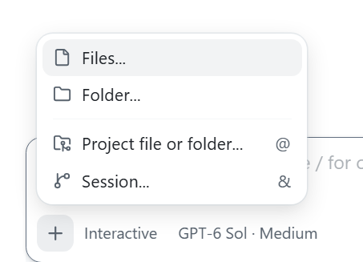	

3. Enter the following prompt, replacing the `[YOUR_WORKSPACE_NAME]` with the name of your workspace:

	```text
	Create a new Direct Lake semantic model with name 'Sales Model' on top of the lakehouse 'Lakehouse_01' in workspace '[YOUR_WORKSPACE_NAME]'.
	
	Use the lakehouse tables: dimension_city, `dimension_customer`, `dimension_date`,`dimension_employee`, `dimension_stock_item`, `fact_sale`

	Consider the team development rules in attached 'team-rules.md'
	```

	**Expected outcome**

	- Because its configured with **Plan mode** agent wont create anything and instead will draft a plan that you can review and adjust before implementation.
	- Because you are asking to create a semantic model it will load the `semantic-model-authoring` skill for guidance on Power BI semantic modeling
	- It will load the `team-rules.md` for development rules context.
	- The agent may ask follow-up questions, for example about the model name or which tables to include. Answer them.
	- The agent returns an implementation plan rather than creating anything.
	- The plan should reflect the rules in `team-rules.md`: for example business-friendly table names without `Fact` or `Dim` prefixes and an `About` table to include a metadata table in the model.
	- No semantic model exists in the workspace yet.

6. Read the plan and check if the rules in `team-rules.md` are being followed.
   
   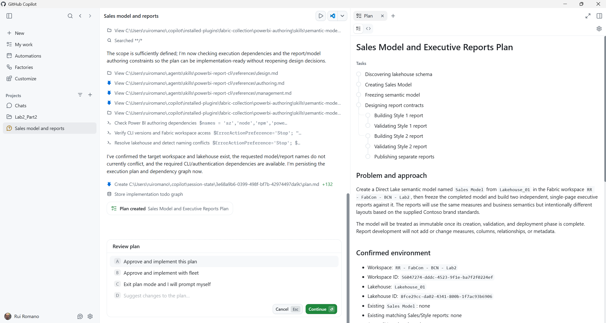

7. Adjust the plan where needed, for example table naming, which measures to create, or the contents of the `About` table.

#### Implement the plan

1. Switch the model picker to a cheaper model such as `GPT-5.6 Terra`.

> [!TIP]
> The implementation phase mostly follows instructions that are already written down, so it does not need the strongest reasoning model.

2. Prompt the agent to implement the approved plan:

	```text
	Implement the plan.
	```

	**Expected outcome**

	- The agent executes the plan step by step without re-planning from scratch.
	- The agent should start by discovering the Fabric workspace and lakehouse ID's and metadata.
	- The agent uses the `database_operations` `Create` operation, which creates a Direct Lake model over the Lakehouse tables and infers their schema in a single tool call.
	- A new semantic model `Sales Model` appears in your workspace.
	- The model follows your team rules.

3. Open the created semantic model in Fabric workspace and confirm the tables with friendly names, the relationships, the hidden base columns, the explicit measures, and the `About` table. It does all this because of [guidance from the `semantic-model-authoring` skill](https://github.com/microsoft/skills-for-fabric/blob/main/skills/semantic-model-authoring/SKILL.md#workflow-create-new-semantic-model).

	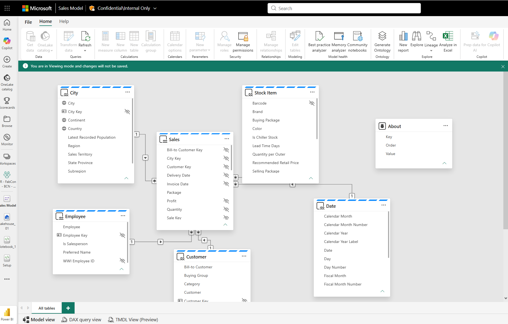

#### Reflection

* When would you choose the GitHub Copilot app over Visual Studio Code or GitHub Copilot CLI for work in a Fabric workspace? All three use the same Copilot orchestrator, skills, and tools.
* How did the instructions in your prompt and `team-rules.md` adapt the approach defined by the existing skill? Which explicit requirements took priority over the skill defaults?
* In this exercise, the agents worked directly against a live Fabric workspace. For real projects, point agents to a development workspace and use [Fabric Git integration](https://learn.microsoft.com/en-us/fabric/cicd/git-integration/intro-to-git-integration) and [Fabric CICD](https://learn.microsoft.com/en-us/fabric/cicd/cicd-overview) to move changes between environments. Do not point agents directly at a production workspaces.

### 2.4 Create two reports with parallel subagents

✅ **Goal**: Use subagents to build two report variations at the same time and pick the better one.

Trying design variations used to be expensive, so most teams built one and lived with it. With subagents you can run both and compare.

#### Steps

1. In the **GitHub Copilot app**, start a new session under the `Lab2_Project` working folder.
2. Turn on **Autopilot** and select `GPT-5.6 Sol` model.
4. Enter the following prompt, replacing the `[YOUR_WORKSPACE_NAME]` with the name of your workspace:

	```text
	Create a report on top of the semantic model 'Sales Model' in workspace '[YOUR_WORKSPACE_NAME]'.
	
	The report must have only one page and it should be focused for executive view of the company.

	I want to try two different styles:
		Style 1 - cards on top with key metrics trend and category breakdowns in the bottom
		Style 2 - cards on the left with key metrics and trend and category breakdown on the right

	Spin two subagents one for each style. Each subagent should create a separate report in the workspace for my review and I'll pick the best one.

	Do not change the semantic model. Use whatever is available in the model and use your best judgement to pick the best measures and fields.

	IMPORTANT:
		When calling `powerbi-report-author preview` with `--host service` and the preview renders an empty/blank report. Stop and apply the following patch:
		
		> The bundled powerbi-client drops `reportDefinition`, idempotently patch the installed CLI `dist\cli.js` and `dist\preview\index.js` before `service.createReport(...)` by wrapping `Create.prototype.create` and copying `this.config.reportDefinition` to `this.createConfig.reportDefinition`.
		
	```

> [!IMPORTANT]
> This exercise uses the semantic model created in Exercise 2.3. If you did not complete that exercise, upload [sales.pbix](resources/sales.pbix) to your Fabric workspace and rename its semantic model to `Sales Model` before continuing.

	**Expected outcome**

	- The agent loads both the `semantic-model-authoring` and the `powerbi-report-authoring` skills.
	- The agent first queries `Sales Model` to understand its tables, measures, and data before designing anything.
	- The agent produces a plan for your review and then starts two subagents, one per style of report.
	- You can see the two subagents running in parallel in the session view and also as a child session of the current chat.
		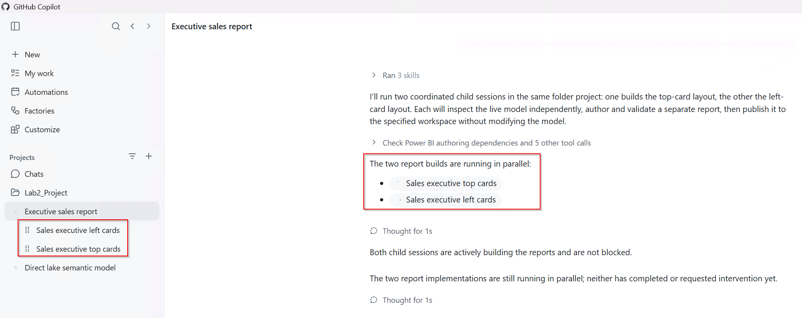
	- Two separate reports appear in your Fabric workspace, each with a single page.
	- Style 1 places the metric cards across the top, with the trend and category breakdowns below. Style 2 places the cards and trend on the left and the category breakdown on the right.
	- The semantic model `Sales Model` is unchanged. No new measures, tables, or columns are added to it.

> [!TIP]
> Subagents run in separate, isolated contexts. Each subagent can focus on its assigned task without mixing its working history with the parent agent or other subagents. This makes them useful for exploring independent approaches in parallel. Learn more in [Agents and Subagents](https://awesome-copilot.github.com/learning-hub/agents-and-subagents/).

5. Review the session transcript of each subagent, each one should have its own reasoning and snapshot preview of the their report style.
   
	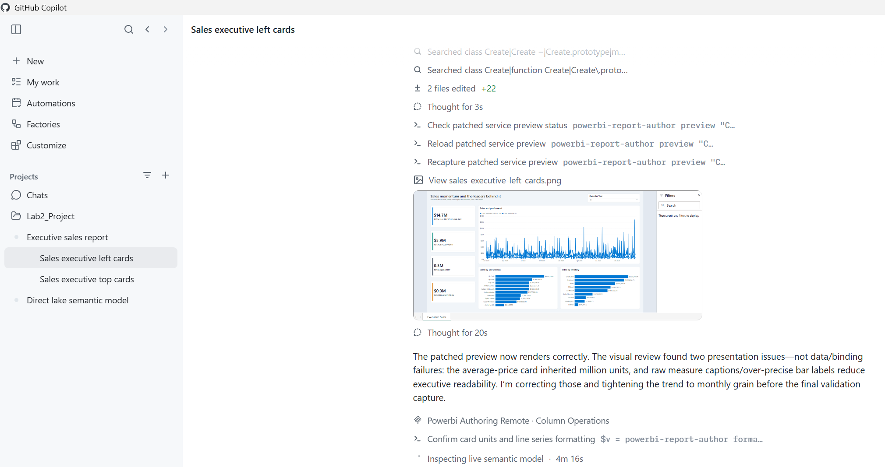

6. Open both reports in the Fabric portal.
7. Compare the layouts, the chosen measures, and the chosen fields.

#### Reflection

* Subagents is a great way to parallelize work using a parent session for orchestration and work. Like silently asking two colleagues to try the same task without them knowing.
* When is running variations in parallel worth the cost, and when is one attempt enough?


## ✅ Wrap-up

You've now learned how to:

* Use Git to review, version, and revert changes made by AI agents
* Guide agents with shared instructions, skills, and project context stored alongside your code
* Combine skills that describe how to work with MCP tools that perform and validate the work
* Separate planning from implementation so you can review an approach before the agent makes changes
* Choose an AI model based on the reasoning, cost, and execution needs of each task
* Use separate sessions to keep unrelated tasks from influencing each other
* Use subagents with isolated contexts to explore independent approaches in parallel
* Work in development environments and promote reviewed changes instead of pointing agents at production
* Apply the same agentic workflow across GitHub Copilot CLI, Visual Studio Code, and the GitHub Copilot app

## Useful links

* [Power BI Desktop projects (PBIP)](https://learn.microsoft.com/power-bi/developer/projects/projects-overview)
* [Power BI MCP servers](https://learn.microsoft.com/en-us/power-bi/developer/mcp/mcp-servers-overview)
* [Skills for Fabric GitHub repo](https://github.com/microsoft/skills-for-fabric)
* [Direct Lake overview](https://learn.microsoft.com/fabric/fundamentals/direct-lake-overview)
* [Model Context Protocol](https://modelcontextprotocol.io/)
* [Agent Plugins spec](https://github.com/agentplugins/agent-plugins-spec)
* [Agent Skills spec](https://agentskills.io/specification)
* [Tabular Editor - Get Started with Agentic Development](https://tabulareditor.com/blog/how-to-get-started-with-agentic-development-for-business-intelligence)
* [Tabular Editor - Pick the right AI model](https://tabulareditor.com/blog/picking-the-ai-model-for-the-task)
* [Tabular Editor - LLMs for data professionals](https://tabulareditor.com/blog/practical-introduction-to-llms-for-data-professionals)
