# Lab - Build Data Apps with Fabric

⏱️ **Total duration:** 90 minutes

## Overview

This lab takes agentic development beyond model authoring and into application creation. Starting from an existing semantic model, you will use **Fabric Data Apps** and natural-language prompts to generate, customize, and refine highly personalized analytical applications with rich customization and flexibility.

## What you will learn

- How to create a **Fabric Data App** from a semantic model
- How to generate application experiences using natural-language prompts
- How to turn visual inspiration into customized data applications
- How to refine an AI-generated application for a specific audience
- How Fabric Data Apps differ from traditional Power BI authoring workflows

## Lab structure

| Section | Learning goal |
| ------- | ------------- |
| [Prerequisites](#prerequisites) | Confirm tools, capacity, model access, and tenant settings |
| [0. Create workspace, app and upload sample model (prep the environment)](#0-create-workspace-app-and-upload-sample-model-prep-the-environment) | Prepare an isolated workspace, sample model, Fabric App, and local project |
| [1. Create the first iteration of the Fabric app](#1-create-the-first-iteration-of-the-fabric-app) | Connect, generate, and deploy the first app experience |
| [2. Iterate on the Fabric app](#2-iterate-on-the-fabric-app) | Add interactive analysis, coaching notes, and Contoso branding |
| [3. Explore and customize](#3-explore-and-customize) | Experiment with creative Fabric App scenarios |

## Prerequisites

Before beginning the lab, confirm that you have:

* Access to the workshop's Fabric tenant with permission to create a workspace
* Access to a Fabric capacity that can be assigned to your workspace
* The **Fabric Apps (preview)** workload enabled for your account by a Fabric tenant administrator
* Permission to download the workshop-provided **Contoso Sales** PBIX file
* A modern web browser such as Microsoft Edge, Google Chrome, or Mozilla Firefox
* A GitHub account with an active GitHub Copilot license
* The [GitHub Copilot app](https://github.com/features/ai/github-app) installed on your computer
* [Node.js and npm](https://nodejs.org/en/download/) installed on your computer


All participants should use the workshop-provided **Contoso Sales** semantic model rather than selecting their own model. This ensures that the prompts, expected results, and validation steps remain consistent across the workshop.

## 0. Create workspace, app and upload sample model (prep the environment)

✅ **Goal**: Create an isolated Fabric workspace, upload the workshop PBIX file, create a Fabric App, and prepare a local project for development.

### Create a workspace

1. Go to [Power BI](https://app.powerbi.com) and sign in with the workshop account.
2. Select **Workspaces** > **New workspace**.
3. Name the workspace using this convention:

	```text
	FabCon-Agentic-Lab3-[YourInitials]
	```

4. Assign the workspace to the available Fabric/Premium capacity and select **Apply**.
5. Wait for the workspace to be created. Use this new workspace throughout the lab to ensure that you have a clean, isolated environment.

### Upload the workshop model

1. Download the workshop [resources/Contoso Sales.pbix](resources/Contoso%20Sales.pbix) and save it to your **Downloads** folder.
2. In your new workspace, select **Import** from the workspace toolbar.
3. Select **Report, Paginated Report or Workbook**.
4. Select **From this computer**.

	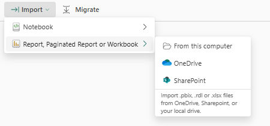

5. In the file picker, open your **Downloads** folder and select `Contoso Sales.pbix`.
6. Select **Open** and wait for the import to finish.

### Verify the model

1. Confirm that a report and a semantic model appear in the workspace.
2. Confirm that the semantic model is named **Contoso Sales**.
3. Open the semantic model and confirm that it loads without errors.
4. Do not make any changes yet.

### Create a Fabric app

1. Return to the workspace you just created containing the **Contoso Sales** semantic model.
2. Select **New item** in the upper-left corner of the workspace.

	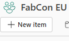

3. In the pane that opens, select **All items**.
4. Enter `App` in the search box.
5. Select **App (preview)** from the search results.

	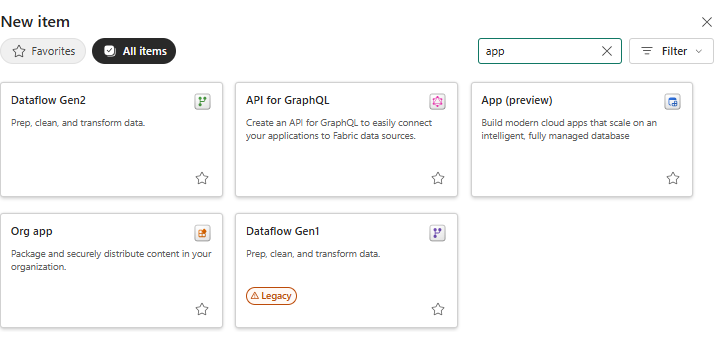

6. In the **New App** dialog, enter a name for your app, such as `Contoso Sales App`.
7. Confirm that **Location** is set to your current workspace.
8. Select **Create**.

	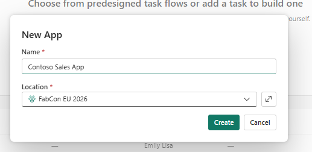

9. On the template selection page, select **Data App**.

	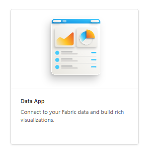

> [!Note]
> You should now see your Fabric App **Overview** page. Confirm that it displays a **Getting started** section with steps to open a terminal, set up your project, edit the app, and publish your changes. A live URL may also appear at the top of the page. Do not run or copy any of these commands yet; the next steps in this lab will walk you through the setup in the correct order.

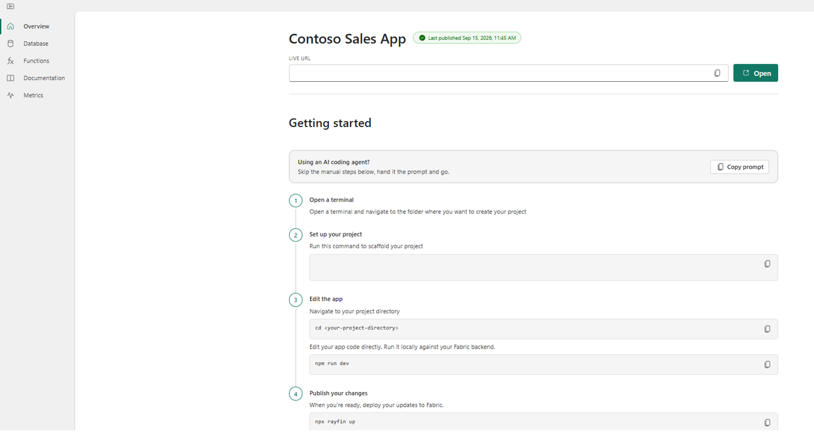

### Create and open the local project folder

1. In File Explorer, create a local folder you'd like to use for the project such as the following example:

	```text
	C:\FabCon\Lab3
	```

2. Open the **GitHub Copilot app**.
3. In **Projects**, select the **+** > **Open folder**, then open the folder you created in step 1 (e.g. `C:\FabCon\Lab3`).
	
	

4. Confirm the folder selection.
5. In the chat pane, open the model selector.
6. Set **Model** to **GPT-5.6 Sol**.
7. Set **Effort** to **Medium**.

	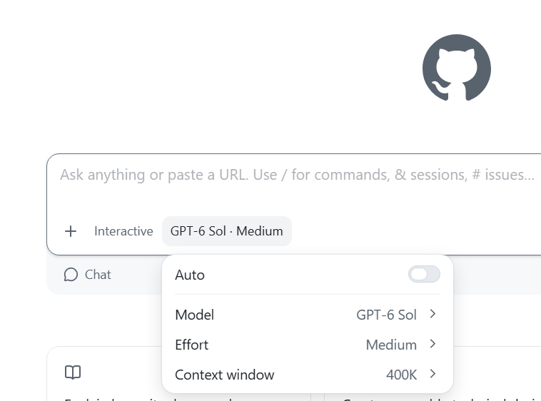

### Scaffold and start the Fabric app

1. Return to your Fabric App in the Fabric portal.
2. In **Getting started**, locate **step 2** and copy the provided scaffolding command.
   
	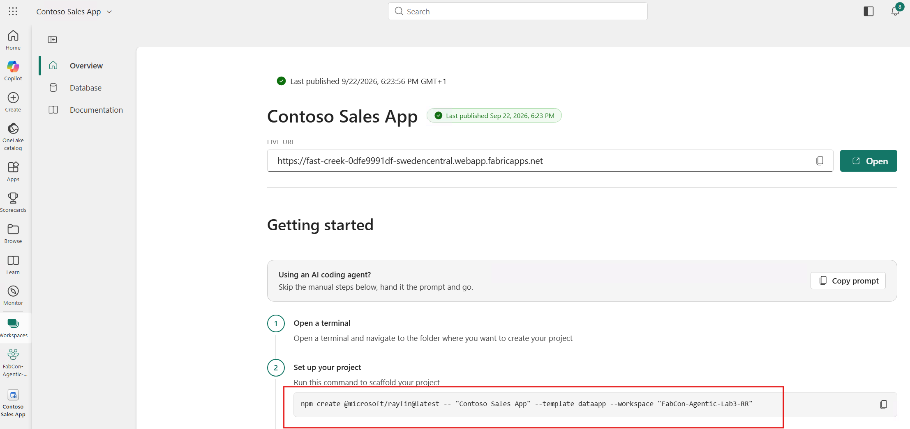

3. Return to the **GitHub Copilot app**, open the session of the project folder and select select **Toggle panel** (`CTRL+ALT+B`) in the upper-right corner.

	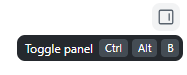

	In the panel that opens, select **Terminal**.

	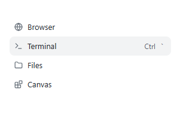

5. A PowerShell terminal will open within the GitHub Copilot app. Paste the copied scaffolding command directly into this terminal and press **Enter**. 

	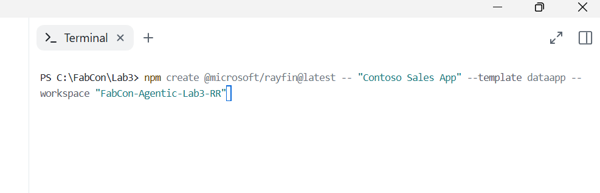

	**Note:** Use the command generated for your Fabric App. The app name, workspace name, and base API URL should differ from the example.

	If prompted, approve any permissions, confirmation or sign-in steps required for the command to run.

	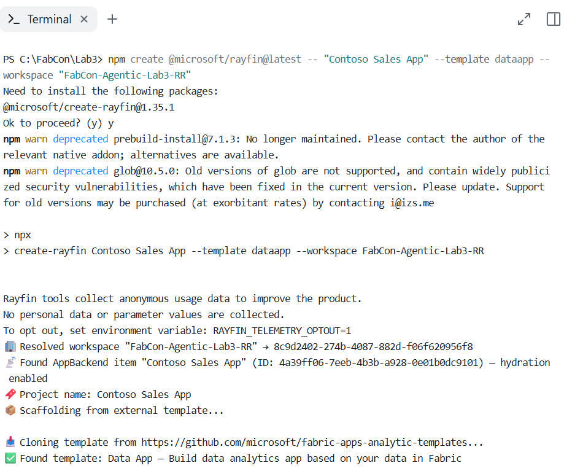

6. After scaffolding finishes, run the following command directly in the same PowerShell terminal pane to open the generated project directory and start the app:

	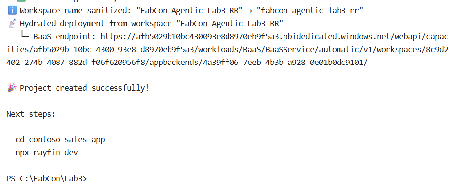

	```powershell
	cd contoso-sales-app
	npm run dev
	```

	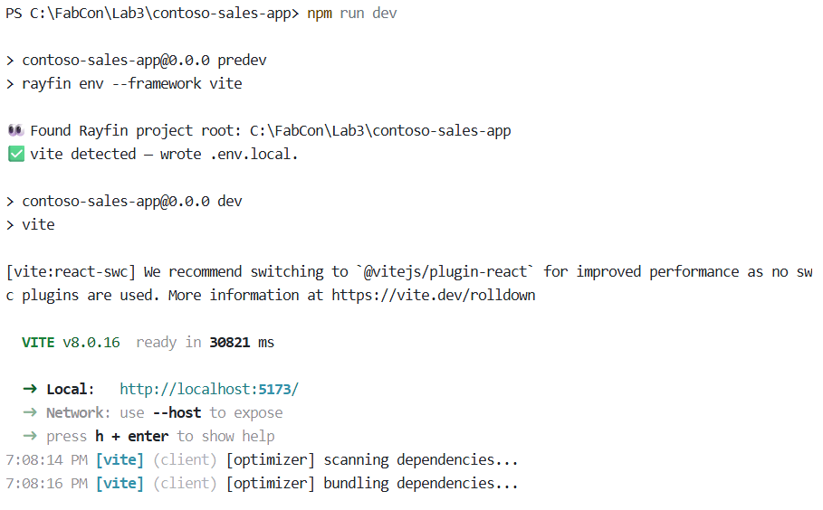

	If prompted, approve any permissions, confirmation steps required for the command to run.

### Expected result

You should now have:

* A clean Fabric workspace named using the `FabCon-Agentic-Lab3-[YourInitials]` convention
* The Contoso Sales report and semantic model in the workspace
* A new Fabric App with the **Data App** template selected
* A project in the GitHub Copilot app
* A scaffolded Fabric Data App project running locally

## 1. Create the first iteration of the Fabric app

✅ **Goal**: Connect the Fabric App to the Contoso Sales semantic model and create the first sales analytics experience using prompts in GitHub Copilot chat.

### Steps

1. Open the **Contoso Sales** semantic model in the Fabric web portal and copy its full URL from the browser address bar. Paste the URL into the **GitHub Copilot App** chat pane as plain text, add the following instruction, and run the prompt:

	```text
	connect my data app to this semantic model : [URL_TO_YOUR_SEMANTIC_MODEL]
	```

	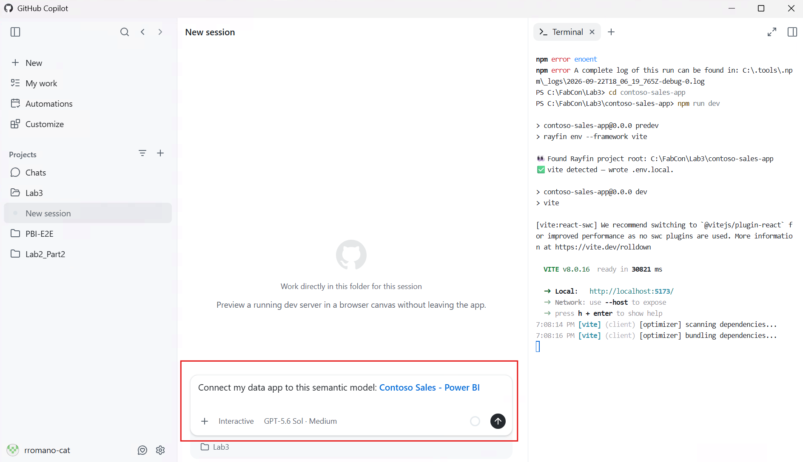

> [!Important]
> Confirm that the full URL is visible as text in the chat pane rather than appearing only as a generic **Power BI** link. The URL contains the semantic model ID and workspace ID that GitHub Copilot needs to connect the app to the correct model.

2. Once that process finishes, enter the following prompt directly in GitHub Copilot chat for your project and ask it to run the required commands:

	```text
	Build and deploy a polished sales analytics app for a Global Sales Manager using the connected semantic model. 
	Analyze store performance with KPIs for Total Sales, Gross Profit, Gross Margin %, Units Sold, and Sales per Unit. 
	Create a responsive store-level scatter plot of Sales per Unit vs. 
	Gross Margin %, with labeled performance quadrants. 
	Highlight top performers, outliers, and improvement opportunities, then deploy the app to Fabric.
	```

> [!NOTE]
> If you forget a PowerShell command, GitHub Copilot can often determine and run the appropriate command on your behalf. For example, the prompt above does not explicitly mention `npx rayfin up`, but Copilot can infer that command from the request to deploy the app to Fabric. Consider the trade-off when choosing an approach: natural-language prompts offer convenience, while running known PowerShell commands directly can reduce token consumption.

3. When **GitHub Copilot** displays the option to open the app in the Fabric portal, select it.

> [!NOTE]
> The screenshot below is one example of an app that this prompt could create. Because the prompt leaves some design and implementation choices open, your app may look different from this example and from the apps generated for other participants. Vague prompts can produce useful Fabric Apps quickly, but you can fine-tune the experience through iterations such as:
>
> 1. Writing a detailed Markdown specification that describes the app's requirements and provides additional context.
> 2. Using plan mode to review and iterate on the requirements before implementation.
> 3. Continuing to refine the first draft with additional prompts, as demonstrated in the next section of this workshop.

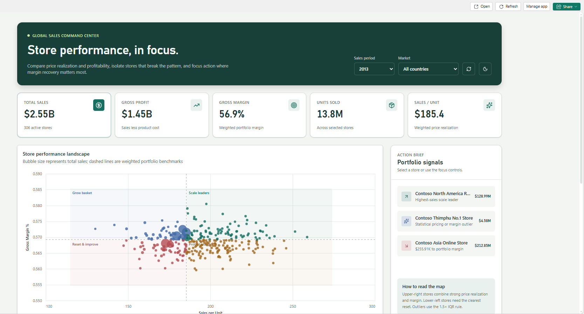

### Expected result

You should now have:

* A connection to the Contoso Sales semantic model
* A first sales analytics experience for global sales managers
* A deployed app that opens in the Fabric portal
* Store-performance insights that highlight top performers, outliers, and improvement opportunities

### Reflection

* How long would it take you to manually create a similar report or dashboard?

## 2. Iterate on the Fabric app

✅ **Goal**: Refine the first app iteration by adding interactive selection, store coaching notes, and flexible Contoso themes.

### Add interactive scatter-plot selection

1. Give **GitHub Copilot** the following prompt:

	```text
	Make the scatter plot fully interactive. 
	Allow selecting individual stores or multiple stores using rectangle and lasso selection, and use those selections to cross-filter the entire app. 
	Include a Clear Selection action alongside the selection actions so users can quickly return to the unfiltered view. 
	Keep the look and feel of the scatter plot clean and not too busy.
	```

2. Wait for **GitHub Copilot** to finish running the prompt, then refresh the app in the Fabric portal (or click the open in Fabric link provided in the response in **GitHub Copilot**).

> [!NOTE]
> The screenshot below is one example of what the updated visual could look like. Because the simple prompt leaves design and implementation details open, your result will likely look different from this example and from the results generated for other participants.

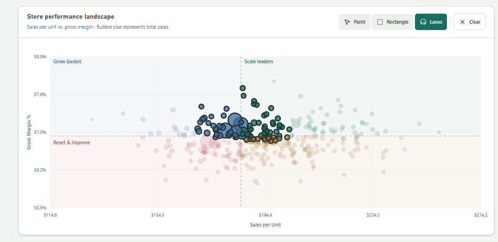
3. Test selecting one store, selecting multiple stores with rectangle and lasso selection, and clearing the selection. Confirm that each selection cross-filters the entire app and that **Clear Selection** restores the unfiltered view.

> [!NOTE]
> If you encounter errors, unexpected behavior, or anything you want to change, prompt **GitHub Copilot** with a clear description of the undesired behavior and the result you want instead. Copilot should be able to help diagnose the issue and implement the requested changes.

#### Reflection

* What steps and skills would be needed to build a visual with this level of customization in Power BI reports today?
* What other customized visual interaction patterns could you create easily using natural-language prompts in Fabric Apps?

### Add store coaching notes

1. Give **GitHub Copilot** the following prompt:

	```text
	Add in-app coaching notes for stores. Allow the ability within this app to create, view, and track notes, action items, and next steps for individual stores, with a historical log of entries. Support adding notes to multiple selected stores at once.
	```

2. Wait for **GitHub Copilot** to finish running the prompt, then refresh the app in the Fabric portal (or click the open in Fabric link provided in the response in **GitHub Copilot**).

> [!NOTE]
> The screenshot below is one example of the coaching-notes behavior this prompt could create. Because the simple prompt leaves design and implementation details open, your result will likely look different from this example and from the results generated for other participants.

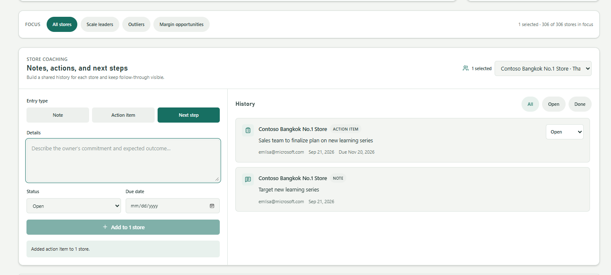

3. Confirm that the app provides options to view and add coaching notes. Test creating a note for one store and for multiple selected stores, then verify that the notes, action items, and next steps appear in the historical log.

#### Reflection

* How does adding write-back change the app beyond just an analytical experience into an operational tool?
* What other useful write-back actions could users take directly within a Fabric Data App?

### Apply the Contoso brand guide

1. Download the existing [Contoso design standards board](resources/img/contoso-design-standards.png). You can upload an image or PDF to **GitHub Copilot** by dragging the file from File Explorer into the chat pane. Alternatively, select the **+** button in the chat pane, select **Files**, and then select the downloaded Contoso design standards file.
2. Give **GitHub Copilot** the following prompt:

	```text
	Restyle the sales dashboard to align with the attached Contoso brand guide while preserving all functionality.
	Allow users to switch the app background to any color from the brand palette, with each theme automatically adjusting colors, contrast, and visuals to remain readable, cohesive, and on-brand.
	```

3. Wait for **GitHub Copilot** to finish running the prompt, then refresh the app in the Fabric portal (or click the open in Fabric link provided in the response in **GitHub Copilot**).

> [!NOTE]
> The screenshot below is one example of how the app could look after applying the Contoso brand guide. Because the simple prompt leaves design and implementation details open, your result will likely look different from this example and from the results generated for other participants.

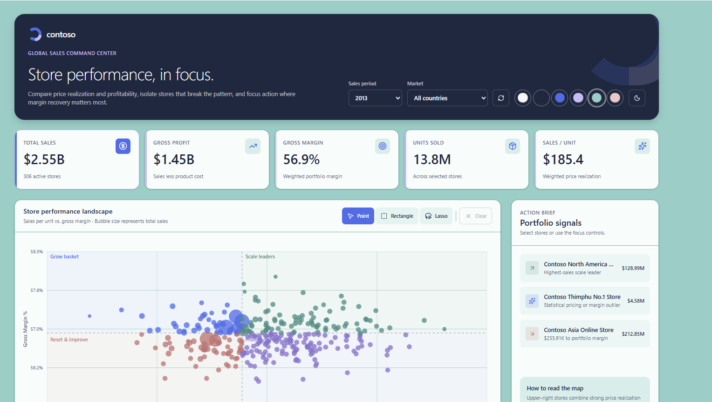

4. Test every available brand-palette background. Confirm that text, controls, and visuals remain readable and cohesive and that the scatter-plot interactions and coaching notes still work.

#### Reflection

* How closely did **GitHub Copilot** match the attached brand guide, and what would you refine in another prompt?
* How did providing a visual reference improve the context available to **GitHub Copilot**?
* What other files or business context could help **GitHub Copilot** produce a more tailored app?

### Expected result

The refreshed Fabric Data App should include:

* Individual, rectangle, and lasso store selection that cross-filters the entire experience
* A **Clear Selection** action that restores the unfiltered view
* Coaching notes, action items, next steps, and history for one or multiple stores that can be viewed and edited all within the app
* Styling that follows the attached Contoso brand guide
* Brand-palette background options that preserve readable contrast and cohesive visuals
* All functionality from the first app iteration

## 3. Explore and customize

✅ **Goal**: Experiment with a new scenario or design change and refine the app through natural-language prompts.

One of the benefits of Fabric Apps is their flexibility and customizability. Use the remaining session time to be creative and explore what works.

### Steps

1. Browse the [Fabric Apps Gallery](https://community.fabric.microsoft.com/category/pbi_comm_galleries/discussions/pbi_fabricappsgallery) for inspiration.
2. Choose another scenario or a unique change that interests you.
3. Ask **GitHub Copilot** to update and deploy your Fabric App.
4. Test the change and continue to iterate

### Expected result

Your deployed app should include:

* At least one personalized change beyond the guided app iterations
* The existing Contoso Sales experience working as expected
* The final version deployed to Fabric


## ✅ Wrap-up

You've now:

* Uploaded the Contoso Sales semantic model and created a Fabric Data App
* Used **GitHub Copilot** and Rayfin to scaffold, run, and deploy the app
* Connected the app to semantic model data and built an analytical experience through iterative prompting
* Applied company design standards using a visual reference and natural-language prompting
* Explored how quickly Fabric Apps can be refined for different users, scenarios, and creative ideas

## Key takeaways

* Fabric Data Apps combine governed Fabric data with flexible, code-based experiences.
* Semantic model context and specific prompts help Copilot generate relevant applications.
* Reviewing, testing, and refining generated changes remains essential.

## Useful links

* [Fabric Apps Gallery | Microsoft Fabric Community](https://community.fabric.microsoft.com/category/pbi_comm_galleries/discussions/pbi_fabricappsgallery)
* [Fabric Data Apps template | Microsoft Learn](https://learn.microsoft.com/fabric/apps/data-apps-template)
* [Fabric Apps overview | Microsoft Learn](https://learn.microsoft.com/fabric/apps/overview)
* [Create a Fabric app | Microsoft Learn](https://learn.microsoft.com/fabric/apps/create-app)