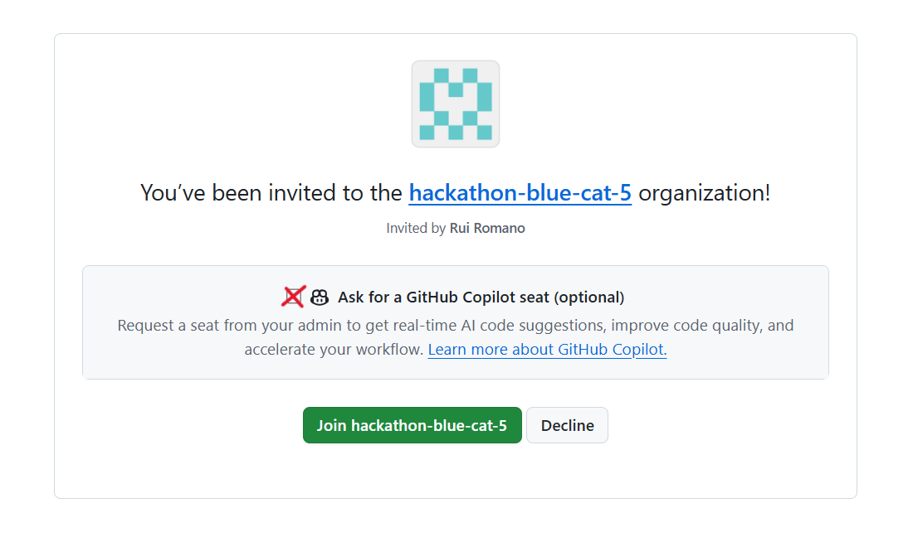
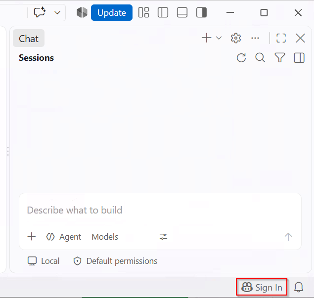
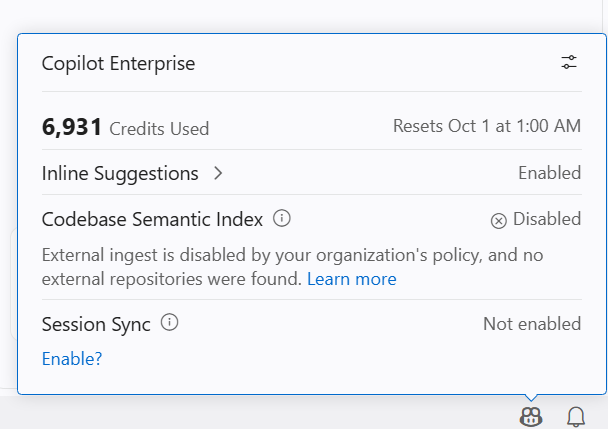
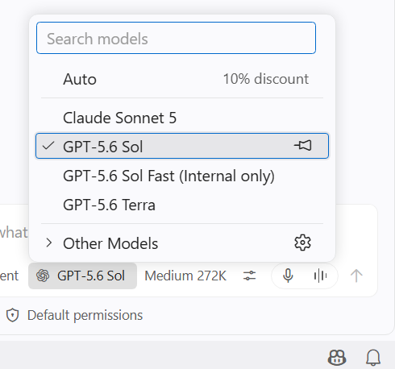

# FabCon Barcelona 2026: Power BI Meets Agentic AI prerequisites

If you have access before the workshop, complete these prerequisites one or two days in advance because new software versions might be available. Otherwise, you can complete them on the day of the workshop.

## Technical Knowledge

Participants should have practical Power BI experience. No prior knowledge of agentic development, GitHub Copilot, or MCP servers is required.

Participants should be able to:
-	Use Power BI Desktop to connect to data and build a report
-	Understand core Power BI semantic model concepts such as tables, relationships, measures, and DAX
-	Navigate the Power BI interface and common authoring workflows

## Laptop

- A Windows laptop, ideally with administrator permissions to install software
- A modern web browser, such as Microsoft Edge or Google Chrome

## Software

Install the following software on the laptop that you will use during the workshop:

- [GitHub Copilot CLI](https://github.com/features/copilot/cli/)
- [GitHub Copilot App](https://github.com/features/ai/github-app)
- [Power BI Desktop](https://pbi.onl/download)
- [Visual Studio Code](https://code.visualstudio.com/download)
- [Git for Windows](https://gitforwindows.org/)
- [Node.js and npm](https://nodejs.org/en/download/)
- [Azure CLI](https://learn.microsoft.com/en-us/cli/azure/install-azure-cli-windows?view=azure-cli-latest&pivots=winget)

You can install each application manually by using the links above. Alternatively, download and run the [resources/install-prerequisites.ps1](resources/install-prerequisites.ps1) PowerShell script to install everything automatically.

1. Download the script to your computer. You can also create a file named `install-prerequisites.ps1` and paste the script into it.
2. Open a terminal in the folder that contains the script, and run:

  ```powershell
  powershell.exe -NoProfile -ExecutionPolicy Bypass -File .\install-prerequisites.ps1
  ```

  If you use PowerShell 7, run the script with `pwsh.exe` instead:

  ```powershell
  pwsh.exe -NoProfile -File .\install-prerequisites.ps1
  ```

3. Review the installation details and final status summary in the console. The script attempts every installation, even if one package fails.

  > [!NOTE]
  > You might see some installation errors for sofware that is already installed. You can ignore these errors if you have confirmed that the requirement is available on your computer and up to date.


## Fabric account and tenant

We will provide a Fabric account with access to Fabric capacity on the day of the workshop.

If you want to use your own Fabric tenant, ensure that the following tenant settings are enabled:

- **Users can use the Power BI Model Context Protocol server endpoint**
- **Allow XMLA endpoints and Analyze in Excel with on-premises semantic models**
- **Enable Fabric App Items**

> [!IMPORTANT]
> The workshop Fabric account will be valid on the day of the workshop and deleted a few days later.

## GitHub account and GitHub Copilot license

We will provide a GitHub Copilot license for the workshop. You can use your own license if you prefer.

To request a GitHub Copilot license for the workshop:

1. Use a **personal GitHub account**. Enterprise Managed User accounts won't work. If you don't have a personal account, [sign up for GitHub](https://github.com/signup).
2. Submit the [GitHub Copilot license request form](https://forms.cloud.microsoft/r/AaJCQCKwAZ) for your personal GitHub account.
3. Look for an invitation by email a few days before or on the day of the workshop. Then follow the steps in [Enable the GitHub Copilot license](#enable-the-github-copilot-license).

> [!IMPORTANT]
> The GitHub Copilot license will only be valid on the day of the workshop. Your access will be removed a few days later.

### Enable the GitHub Copilot license

1. Check the **email associated with your GitHub account** for an invitation to join the workshop organization.
2. Select **Ask for a Copilot seat**.

   

3. Wait a few moments for the seat to be provisioned.
4. Close all **Visual Studio Code** windows.
5. Open **Visual Studio Code**.
6. Open **GitHub Copilot Chat** (`Ctrl+Alt+I`).
7. Select **Sign in** in the lower-right corner. Sign in with the GitHub account that you entered in the license request form.

   

   > [!NOTE]
   > You might need to sign out and sign back in for the new Copilot license to take effect.

8. You should see the Copilot icon in the VS Code status bar (bottom of the window).

   

9. Confirm that you can select a reasoning model provided for the workshop.

   

