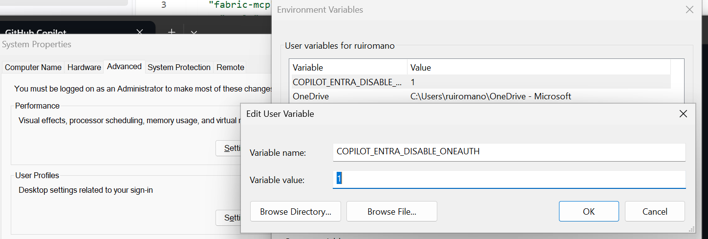

# Workshop troubleshooting

### Scenario: Cannot authenticate the Remote Power BI Authoring MCP with the workshop Fabric account

The current version of the GitHub App might use single sign-on to authenticate the Power BI MCP with a different account, without providing an option to force the authentication prompt.

Known public issue:
- https://github.com/github/copilot-cli/issues/4660

#### Solution

1. Set the `COPILOT_ENTRA_DISABLE_ONEAUTH` environment variable to `1`.
    
    
    
2. Open a new terminal.
3. Open the GitHub Copilot CLI.
4. Enter `/mcp`.
5. Select the Power BI Remote MCP server.
6. Copy the authentication URL.
7. Open the URL in a browser window where you are signed in with the workshop Fabric account.